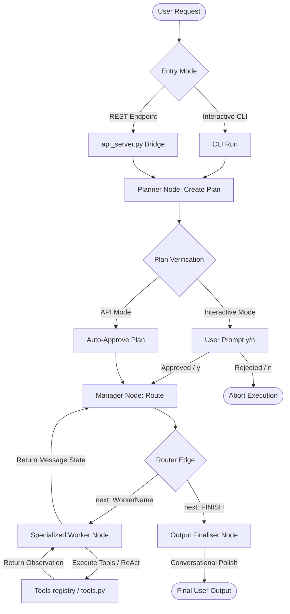

# 🤖 Multi-Agent Orchestration: Detailed Flow & Threat Analysis

This document provides a highly technical, end-to-end breakdown of the **AI Personal Assistant Backend's** execution flow (built on LangGraph). It maps each step of execution, explains its underlying mechanics, and identifies critical **architectural, model-level, and operational flaws** alongside mitigation strategies.

---

## 🗺️ Complete Agent Execution Flow

Below is the chronological path a user request takes through the system, from entry to final output.

---

## 🔍 Step-by-Step Breakdown & Flaw Analysis

---

### Step 1: User Request & Entry Point
A command is submitted (e.g. *"Get system stats and save to report.txt"*).
* **CLI Mode**: Handled in `main_graph.py` by `process_request_interactive()`.
* **API Server Mode**: Handled in `api_server.py` calling `process_command()` in `src/CoreFunctions/agent_logic.py`.
* **Mechanics**: Initializes an `AgentState` consisting of `messages` (a list of BaseMessages), `next` (target node pointer), and `final_response` (string).

#### 🔴 Potential Flaws
1. **Unfiltered Context Growth**: In REST mode, if large historical chat payloads are passed continuously without slicing/pruning, the state will eventually overflow the local LLM's context window.
2. **REST-Planner Disconnect**: Because the REST API server does not support human-in-the-loop interaction, it must bypass/auto-approve the planning stage, removing the critical safety check against malicious or faulty plans.

---

### Step 2: The Planner Node (`Planner`)
Acts as the initial reasoning layer (`src/CoreFunctions/LangGraph/planner_declare.py`).
* **Mechanics**: The system prompt (`PLANNER_PROMPT`) formats all available workers (`GmailWorker`, `ProductivityWorker`, `MemoryWorker`, `SystemWorker`). The local LLM (`gemma4:e4b`) evaluates the request and generates a sequential, numbered plan (e.g. *1. SystemWorker: get_system_stats, 2. SystemWorker: write_file*).

#### 🔴 Potential Flaws
1. **Single-Shot Planning Brittle**: If the Planner hallucinates a step or proposes an invalid worker, there is no self-correction mechanism. The graph will try to execute this flawed plan.
2. **Context Collapse on Complex Prompts**: Small models (`4B` size) struggle to build accurate conditional plans (e.g., *"If I have unread emails from John, draft a reply, otherwise list my calendar"*). They usually collapse this into a simple linear sequence.
3. **Strict Formatting KeyErrors**: The prompt format is highly sensitive. Standard formatting anomalies (like non-doubled literal curly braces `{}`) will crash the parser before execution starts.

---

### Step 3: Plan Verification Interrupt
A gatekeeping step designed for human oversight.
* **Mechanics**: The graph is compiled with `interrupt_after=["Planner"]`. In CLI mode, it pauses, prints the plan, and asks for approval. In API mode, `agent_logic.py` automatically resumes execution with a mock approval parameter.

#### 🔴 Potential Flaws
1. **Auto-Approval Exposure**: Bypassing the verification step on API calls opens up the system to unsafe execution paths if the model hallucinated a tool like `run_terminal_tool`.
2. **Lack of Dynamic Re-planning**: If a plan is rejected (`n`), the program simply aborts. There is no feedback loop where the user can say *"No, don't email it, just write to file"* and have the Planner adjust the plan dynamically.

---

### Step 4: The Manager / Supervisor Node (`Manager`)
The orchestrator of execution (`src/CoreFunctions/LangGraph/manager_declare.py`).
* **Mechanics**: The Manager receives the state (including the plan and previous worker results) and uses a structured LLM (`with_structured_output`) bound to a Pydantic `RoutingDecision` model. It decides the name of the next worker to invoke, or outputs `"FINISH"` along with a raw text response.

#### 🔴 Potential Flaws
1. **Local LLM Structured Output Failure**: Forcing Pydantic schemas on small, local quantized models often fails. If the model output format is slightly off, parsing fails, crashing the execution mid-graph.
2. **Infinite Routing Loops**: If a worker fails to execute a task and returns an error (e.g. *"Gmail authentication failed"*), the Manager might repeatedly send the request back to the same worker, resulting in CPU resource depletion and log flooding.
3. **Planner/Manager Deviation**: The Manager does not strictly follow the plan; it treats it as context. If the plan was complex, the Manager might decide to jump steps, causing unexpected results.

---

### Step 5: Specialized Workers & Tool Execution
Individual specialists executing tasks (`src/CoreFunctions/LangGraph/worker_define.py`).
* **Mechanics**: Workers (`SystemWorker`, `GmailWorker`, etc.) are individual ReAct agents initialized via LangGraph's prebuilt `create_react_agent`. They run their own loop: outputting tool-calling JSON, executing local python functions in `src/CoreFunctions/tools.py`, observing results, and feeding them back to the state.

#### 🔴 Potential Flaws
1. **Command Injection / Host Compromise**: The `SystemWorker` has absolute access to `run_terminal_tool` and `run_python_tool`. Although wrapped in `verify_password()`, a successful prompt injection bypassing the worker system prompt can trigger dangerous system commands.
2. **Context Window Flooding**: If a tool returns a huge payload (e.g., `list_files_tool` listing 500 files or `read_file_tool` reading a massive CSV), the entire payload is appended directly into the message history. This immediately crashes the LLM's context size or severely degrades prompt performance.
3. **Error Cascade**: If a tool throws an exception, the observation returned is a raw error string. If the worker's LLM panics, it might hallucinate credentials or crash.

---

### Step 6: Output Finaliser Node (`output_finaliser`)
The communication polish layer (`src/CoreFunctions/LangGraph/output_finaliser.py`).
* **Mechanics**: Triggered when routing decides `"FINISH"`. It takes the Manager's raw technical message and uses a higher temperature (0.7) to rephrase it into natural, friendly, conversational language.

#### 🔴 Potential Flaws
1. **Fact Hallucination**: Higher temperature values can lead the finalizer to rewrite critical dry facts into polished, incorrect statements (e.g., rephrasing *"Process 8443 killed"* to *"I went ahead and safely closed down all your background apps!"*).
2. **Double Latency**: Running an additional, full LLM call just to change the tone adds a significant time overhead (typically 1.5 - 3.5 seconds on local GPUs/CPUs).

---

## 🛡️ Summary of Critical Architectural Vulnerabilities & Mitigations

| Vulnerability | Impact | Mitigation Strategy |
| :--- | :--- | :--- |
| **Tool Payload Explosion** | Context exhaustion, system slowdown, agent crash. | Implement a **truncation wrapper** in `tools.py` that limits read buffers (e.g. max 2000 characters) and prints a summary for files that exceed limits. |
| **API Server Auto-Approval** | Potential execution of harmful shell commands without human consent. | Implement an **action-class partition**. Safe tools (weather, time, calendar read) auto-approve, but execution/file write actions prompt a security token check via the API. |
| **Infinite Routing Loops** | High CPU utilization, API usage wastage, system hang. | Implement a **loop counter** in `AgentState` that tracks successive worker transitions. If a single node is called >3 times without state change, force transition to `output_finaliser` with an error message. |
| **Structured Output Failure** | Parsing crashes. | Fall back to robust string-parsing regex patterns if the Pydantic schema validation fails. |
