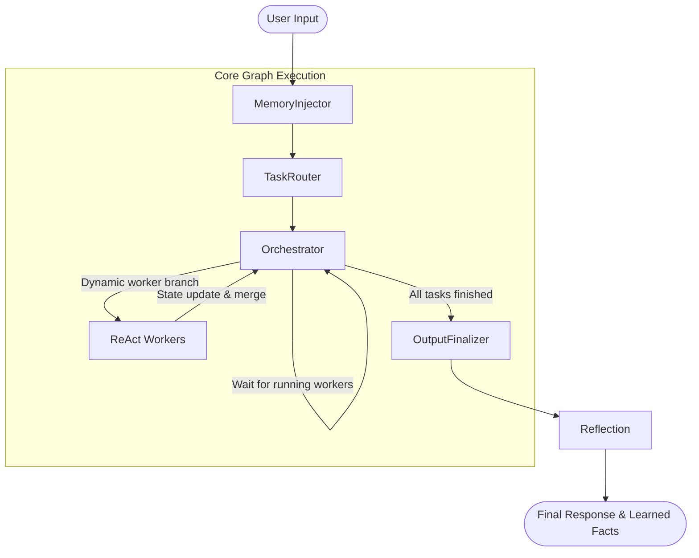

# 🏗️ AI Personal Assistant - Architectural Deep-Dive

This document provides a comprehensive technical overview of the backend's architecture, execution mechanisms, security policies, and observability systems.

---

## 1. Core Paradigm: State-Graph Cyclic Execution

Most modern multi-agent systems rely on linear reasoning chains or open-ended ReAct loops. These approaches are prone to:
* **Context Pollution**: The agent prompt grows indefinitely as it runs tools, leading to memory drift.
* **Infinite Loops**: The agent can get stuck calling the same tool repeatedly.
* **GIL/Thread Lockups**: Stalling when doing concurrent input prompts.

This system resolves these flaws by implementing a **Cyclic State Machine** built on **LangGraph**. The overall lifecycle is broken into isolated, specialized nodes that communicate exclusively by reading and writing to a central, schema-enforced state object (`AgentState`).



---

## 2. State representation: `AgentState`

The entire graph coordinates via `AgentState` (defined in [state.py](file:///home/prit/Project_Linux/AI-Personal-Assistant-Backend/src/CoreFunctions/StateGraph/state.py)). It contains the following schema:

```python
from typing import TypedDict, List, Dict, Any

class AgentState(TypedDict):
    primary_goal: str               # The raw prompt submitted by the user
    active_subtasks: List[Dict]     # The generated DAG plan of subtasks
    working_memory: Dict[str, Any]  # Transient storage for intermediate tool results
    completed_tasks: Dict[str, Any] # Persistent store for completed task summaries
    final_response: str             # The synthesized output shown to the user
    chat_history: List[Dict]        # Backlog of recent conversation exchanges
    error_logs: str                 # Thread isolated exception logs
    next_node: Any                  # Control variable determining node transitions
```

### Subtask Schema
Each entry in `active_subtasks` is structured as a task dictionary:
* `id`: Unique task identifier (e.g., `task_1`, `task_2`).
* `description`: Actionable description for the worker.
* `assigned_worker`: The target worker node (e.g., `GmailWorker`).
* `status`: Current execution state (`"pending"`, `"in_progress"`, `"completed"`, `"failed"`).
* `depends_on`: A list of preceding subtask IDs that must be completed first.

---

## 3. Node Specifications & Lifecycle

### 🧠 Stage 1: Context Enrichment (`MemoryInjector`)
When a query starts, the [MemoryInjector](file:///home/prit/Project_Linux/AI-Personal-Assistant-Backend/src/CoreFunctions/StateGraph/memory_nodes.py) node conducts parallel context gathering:
1. **User Profile**: Reads static key-value details from `Memory/user_info.json`.
2. **Long-Term Vector Memory**: Queries ChromaDB semantically to fetch details from previous turns.
3. **Procedural Skills Ingestion**: Searches the local **FAISS Vector Store** (`skills_index.faiss`) for skills semantically related to the goal, and loads the matched manuals into memory.
This enriched context is written to `working_memory` so that downstream planners and workers are context-aware.

### 📋 Stage 2: Intent Decomposition (`TaskRouter`)
The [TaskRouter](file:///home/prit/Project_Linux/AI-Personal-Assistant-Backend/src/CoreFunctions/StateGraph/task_router.py) parses the goal and context, generating a structured list of subtasks (a Directed Acyclic Graph, or DAG).
* It parses the output using Pydantic schemas.
* It allocates dependencies to prevent workers from running out of order. For example, a task to send a file via email will depend on the preceding task that downloads the file.

### 🔄 Stage 3: Orchestration Scheduler (`Orchestrator`)
The [Orchestrator](file:///home/prit/Project_Linux/AI-Personal-Assistant-Backend/src/CoreFunctions/StateGraph/orchestrator.py) evaluates the task queue and determines routing:
* **Parallel Forking**: If multiple tasks have all dependencies completed, it returns a list of target workers (e.g., `["GmailWorker", "SystemWorker"]`). LangGraph forks execution and launches them in parallel.
* **Deadlock Resolution**: If no new tasks are ready, but some are currently `"in_progress"`, it indicates orphaned tasks from a previously interrupted run. The orchestrator actively resets these orphaned tasks to `"pending"` to self-heal the graph and prevent infinite loops.
* **Dependency Failure Detection**: If tasks are `"pending"` but no task is running, the orchestrator identifies a dependency deadlock (e.g. if a prerequisite task failed), aborts the blocked tasks, and exits to the finalizer to prevent hangs.

### 💻 Stage 4: Execution Layer (ReAct Workers)
Workers are isolated ReAct agents pre-compiled with a strictly scoped tool menu:
* **Category Registry**: When a worker starts, it loads category-specific skills from the index registry using `_load_worker_skills(worker_name)` (in [workers.py](file:///home/prit/Project_Linux/AI-Personal-Assistant-Backend/src/CoreFunctions/StateGraph/workers.py)).
* **Execution Summary**: Upon completion, the worker outputs only a concise summary which is saved to `completed_tasks`, while detailed logs are offloaded to session cache files if they exceed context limits.

### 💡 Stage 5: Passive Reflection (`Reflection`)
After outputting the response, a background thread runs the [Reflection](file:///home/prit/Project_Linux/AI-Personal-Assistant-Backend/src/CoreFunctions/StateGraph/memory_nodes.py#L226) node:
* It extracts user facts or procedural guidelines from the conversation.
* Rebuilds the FAISS vector database automatically if skills are updated.

---

## 4. Security & Input Serialization Gateways

### 🔐 Password Mutex Lock (`verify_password`)
Protected system-level tools (e.g., modifying system skills, terminal executions) require authorization.
* **Thread Mutex**: A global mutex lock `_stdin_lock` in [auth_utils.py](file:///home/prit/Project_Linux/AI-Personal-Assistant-Backend/src/CoreFunctions/auth_utils.py) serializes console input requests.
* **Introspection Banners**: It walks active python frames (`inspect.stack()`) to fetch:
  1. The calling worker's name.
  2. The active task description.
  3. The current tool execution step/reason.
* This is formatted into a visual, secure terminal card before asking for password input.

### 🚦 Human-in-the-Loop (HITL) Interceptions
For async tasks (such as Browser worker handling logins or CAPTCHAs), the worker calls `request_human_intervention`.
* It calls `locked_intervention_prompt` in [tools.py](file:///home/prit/Project_Linux/AI-Personal-Assistant-Backend/src/CoreFunctions/tools.py), acquiring the console input lock and presenting a yellow card banner to the user to safely freeze execution until the blocker is resolved.

---

## 5. Observability & Logging Architecture

The personal assistant writes concurrent logging data during execution using [logger.py](file:///home/prit/Project_Linux/AI-Personal-Assistant-Backend/src/CoreFunctions/logger.py):

* **Human-Readable Text Logs**: Writes clean, structured trace timelines showing node bounds, worker startups, reasoning steps, tool calls, and final responses.
* **Machine-Readable JSON Logs**: Writes complete state traces with inputs, step timings, and returns, allowing visual timeline debugging.

Files are stored dynamically:
* Per-session logs: `Memory/logs/session_<id>.log` and `Memory/logs/session_<id>.json`.
* Global latest trace: `Memory/logs/latest.log` and `Memory/logs/latest.json`.
