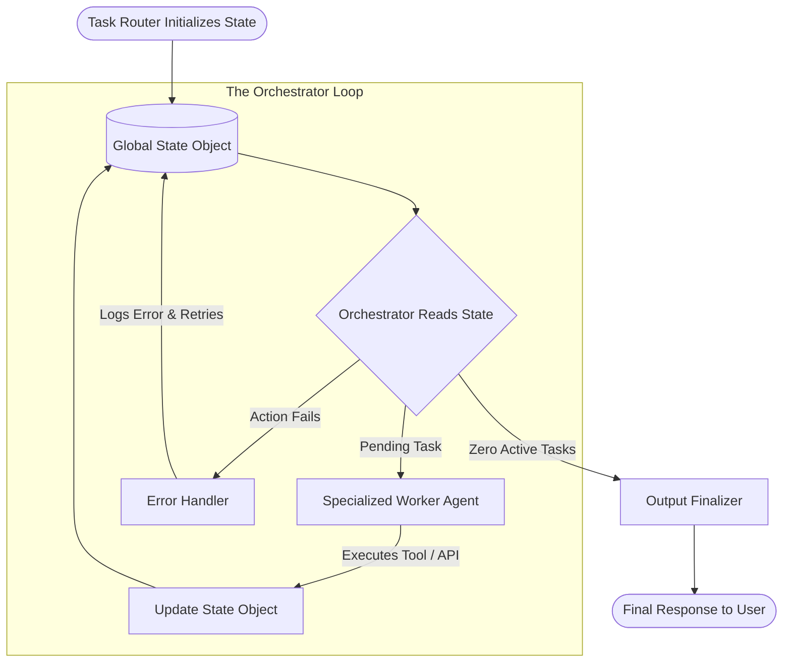

# 🤖 AI Personal Assistant (Backend)

> **"LLMs decide, Code executes."**

A powerful, secure, and extensible local AI assistant designed to interact with your system, manage communications, and organize your digital life. Built with a modular, **Dynamic State-Graph Multi-Agent Architecture**, it prioritizes safety and local control while leveraging state-of-the-art LLMs for orchestration and tool-use execution.

---

## 🚀 Project Overview

This project implements a highly resilient, state-driven backend for an AI Personal Assistant. Unlike traditional ReAct loops or monolithic agents that struggle with context window pollution, this system decomposes complex user prompts into discrete, isolated tasks, maintaining strict security and localized execution.

### Key Philosophies

* **🛡️ Safety First**: High-risk actions (like writing files, launching apps, or running terminal commands) are explicitly password-protected via a validation hook.
* **🧩 Cyclic State-Graph Execution**: Relies on a global **State Object** to maintain context, eliminating agent confusion and token inflation.
* **🧠 Automated Self-Learning**: Features an advanced memory system that learns user preferences implicitly and injects relevant history at runtime.

---

## ✨ Features & Architecture

### 1. The Core State-Graph Architecture

The backend operates on a tightly-controlled state machine defined inside `src/CoreFunctions/StateGraph/`.



* **Task Router (`task_router.py`)**: Acts as a semantic parser to split complex instructions (e.g. *"Check my system health and email the report to Rohan"*) into independent, sequentially ordered sub-tasks.
* **Orchestrator (`orchestrator.py` & `main_graph.py`)**: Reads the active state, delegates tasks to the respective Workers, validates outputs, and updates the global `working_memory`.
* **Memory Injection & Self-Reflection (`memory_nodes.py`)**:
  * **`MemoryInjector` Node**: Analyzes the query, checks if personal context is needed, and automatically pulls key profile variables from `Memory/user_info.json` and semantic vector memory.
  * **`Reflection` Engine**: Evaluates completed executions post-turn to extract permanent facts (e.g. *"prefers terminal over GUI"*) and saves them automatically to the JSON database and long-term vector database.

---

### 2. Specialized Worker Agents & Toolsets

Workers are isolated, pre-compiled ReAct agents running under `gemini-3.1-flash-lite`.

| Agent                           | Purpose                                                                                         | Tools                                                                                                                                                                                                                                         |
| :------------------------------ | :---------------------------------------------------------------------------------------------- | :-------------------------------------------------------------------------------------------------------------------------------------------------------------------------------------------------------------------------------------------- |
| **💻 SystemWorker**       | Manages OS configurations, sandboxed files, shell command executions, and hardware diagnostics. | `run_terminal_tool`, `run_python_tool`, `launch_app_tool`, `create_file_tool`, `read_file_tool`, `list_files_tool`, `create_dir_tool`, `save_code_tool`, `get_system_health`, `get_weather`, `get_time`, `web_search` |
| **📧 GmailWorker**        | Handles inbox querying, email searches, and mailing tasks securely.                             | `fetch_unread_mails`, `send_gmail`, `search_gmail`, `read_gmail_msg`, `trash_gmail_msg`, `mark_gmail_read`, `reply_to_gmail`                                                                                                             |
| **📅 ProductivityWorker** | Orchestrates calendar appointments, active tasks, weather checks, and time retrieval.           | `add_google_task`, `check_calendar_events`, `add_calendar_event`, `get_system_health`, `get_weather`, `get_time`, `web_search`                                                                                                  |
| **🏫 ClassroomWorker**    | Manages Google Classroom courses, coursework, assignments, and announcements.                  | `list_classroom_courses`, `list_classroom_assignments`, `list_classroom_announcements`, `get_classroom_assignment_details`                                                                                                               |
| **🧠 MemoryWorker**       | Responsible for managing the manual recall and retention of key facts.                          | `recall`, `remember`                                                                                                                                                                                                                      |

> [!IMPORTANT]
> All file operation and command execution tools (e.g., `run_terminal_tool`, `create_file_tool`, `launch_app_tool`) are fully wrapped with `verify_password()` in `auth_utils.py` and require user authentication at runtime before execution.

---

## 🛠️ Directory Structure

```text
AI-Personal-Assistant-Backend/
├── Memory/                 # JSON profile and vector database persistence
├── config/                 # Google API credentials & configurations
├── src/
│   ├── Apps/               # Functional Modules ("The Hands")
│   │   ├── Calendar/       # Google Calendar API integration
│   │   ├── Gmail/          # Google Gmail API client
│   │   ├── Classroom/      # Google Classroom API integration
│   │   ├── FileOperations/ # Protected sandboxed file management
│   │   ├── System/         # Hardware diagnostics (CPU, RAM, Battery)
│   │   ├── SystemControl/  # Terminal command execution and script launching
│   │   └── Spotify/        # Local Spotify playback hooks
│   │
│   ├── CoreFunctions/      # Intelligent Orchestration ("The Brain")
│   │   ├── StateGraph/     # Dynamic State-Graph Multi-Agent Orchestrator
│   │   ├── LangGraph/      # (Legacy) Monolithic planner and agents
│   │   ├── tools.py        # Central Registry of available Python tools
│   │   ├── memory.py       # JSON-based structured persistent memory
│   │   ├── vector_memory.py# Vector database (ChromaDB) semantic search
│   │   └── auth_utils.py   # Password verification and security logic
│   └── main.py             # Root entry point
├── requirements.txt        # Python package dependencies
└── .env                    # System password & Gemini API credentials
```

---

## 🏁 Getting Started

### Prerequisites

* Python 3.10+
* Google Gemini API Key (Gemini 3.1 Flash-Lite)
* Google OAuth credentials (placed in `config/` for Gmail/Calendar tools)

### 1. Installation

Clone the repository and set up a virtual environment:

```bash
git clone https://github.com/yourusername/AI-Personal-Assistant-Backend.git
cd AI-Personal-Assistant-Backend
python -m venv .venv
source .venv/bin/activate  # On Windows: .venv\Scripts\activate
pip install -r requirements.txt
```

### 2. Configuration

Create a `.env` file in the root directory:

```ini
GEMINI_API_KEY=your_gemini_api_key_here
SYSTEM_PASSWORD=your_secure_authorization_password
```

### 3. Execution

Launch the State-Graph Multi-Agent system:

```bash
python src/CoreFunctions/StateGraph/main_graph.py
```

---

## 🗺️ Roadmap & Future Goals

* [ ] **Full Offline Independence**: Replace cloud LLM endpoints (Gemini) with local quantized open models (via Ollama integration) for absolute data privacy.
* [ ] **Comprehensive Dashboard**: Build a real-time terminal visualizer or modular companion to monitor active agent states, state transitions, and tool-call pipelines.
* [ ] **Speech Integration**: Add localized speech-to-text (Whisper) and lightweight voice synthesizers (TTS) for completely hands-free desktop execution.
* [X] **Smart Context (Implemented)**: Implicit self-learning preference retention and context-aware injection (State-Graph `MemoryInjector` + `Reflection` Node).
* [ ] **Universal App Ecosystem**: Extend standard apps to Notion, Obsidian, and generic native window manager automations.

---

## 🤝 Contributing

Contributions are highly encouraged! Please review the `PROJECT_DOCUMENTATION.md` for a comprehensive look into core API schemas, state definitions, and developer guidelines before opening a pull request.
