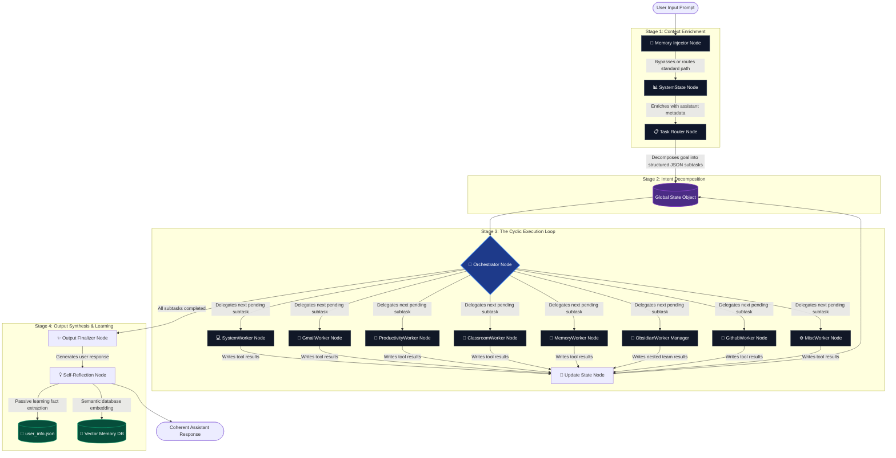
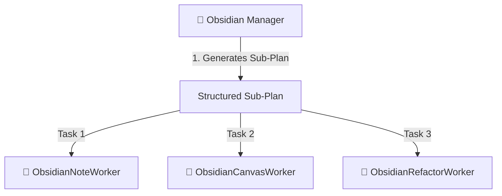

# 🤖 AI Personal Assistant (Backend)

> **"Intelligent Decision-Making, Secure Local Execution."**

A powerful, secure, and extensible local AI assistant designed to interact with your system, manage communications, and organize your digital life. Built with a modular, **Dynamic State-Graph Multi-Agent Architecture**, it prioritizes safety, localized execution, and low-latency orchestration while leveraging state-of-the-art LLMs for reasoning and tool execution.

---

## 🏗️ System Architecture & Request Lifecycle

Unlike traditional ReAct loops or monolithic agents that struggle with context pollution, memory drift, and token bloat, this backend operates on a tightly-controlled **cyclic state machine** built on LangGraph.

Here is the exact visual lifecycle of a user request as it moves through the multi-agent system:



---

## ✨ Latest Updates & Enhancements

We have recently upgraded the personal assistant with a series of core security, speed, and observability improvements:

* **🔌 Dynamic Worker Registration & Model Configuration**: Auto-discovers ReAct agents dynamically from the `Workers/` folder using the new `WorkerRegistry` framework. Execution options and LLM choices (e.g. Gemini with thinking budgets vs. local Ollama models) are synced and loaded via the `config/workers_config.json` configuration file.
* **💾 SQLite Database Unified Memory Cache**: Replaced flat JSON cache files with a unified database structure (`Memory/workspace_cache.db` or optional Redis/Postgres) managing thread-safe transactional persistence with transaction buffers.
* **📊 Structured Observability Logging System**: All node transitions, worker execution flows, reasoning thoughts, tool calls with JSON parameters, and final responses are logged concurrently to:
  * Human-readable text logs: `Memory/logs/latest.log` and `Memory/logs/session_<id>.log`.
  * Machine-readable JSON execution traces: `Memory/logs/latest.json` and `Memory/logs/session_<id>.json`.
* **⚡ Skills Semantic Search (FAISS)**: Replaced slow recursive file/directory scanning with a dedicated **FAISS vector database** using `all-MiniLM-L6-v2`. Skill discovery is now instantaneous, and query matches are performed semantically and read from cache.
* **🔓 Password-Free Skill Discovery**: The `search_skills` tool is now completely password-free and read-only, allowing workers to lookup capability manuals without authorization hurdles.
* **🔒 Serialized Stdin Prompts & Lock**: Solved terminal collision issues during parallel worker runs. A global `_stdin_lock` serializes all password verification (`verify_password`) and human intervention (`request_human_intervention`) inputs.
* **📇 Stack-Introspected Banners**: Prompts now walk active python call stacks (`inspect.stack()`) to render a visual card showing (1) The requesting agent name, (2) The active task being run, (3) The exact step/reason for the prompt.
* **🔄 Orchestration Deadlock Resolution**: Orchestrator node now actively detects and resets orphaned `in_progress` tasks from previous aborted sessions to `pending`, preventing graph execution deadlocks and infinite loops during State-Graph processing.
* **🧠 Context Memory Optimization**: The `TaskRouter` to `Worker` context injection is now strictly sandboxed via dependency mapping. Workers only receive the output of explicitly requested prerequisite tasks (`depends_on`), preventing context bloat and saving LLM tokens.
* **⚡ Context Cache Lifecycle Management (Gemini Caching)**: Implemented a custom `GeminiCacheManager` and `CachedChatGoogleGenerativeAI` subclass to automatically manage Google Gemini context caches at runtime. It monitors prompt sizes, registers/retrieves context caches, and handles cache expiration (404s) seamlessly. This significantly lowers token costs and speeds up inference on heavy worker prompt cycles.
* **🧠 Memory Introspection & Programmatic Tools**: Introduced new programmatic memory manipulation tools (`update_unified_memory`, `list_memory_keys`) to allow workers to list existing cache keys and update the transactional Unified Memory database directly, reflecting state changes instantly.
* **🛠️ Interactive Unified Memory CLI Helpers**: Added utility scripts (`write_memory.py`, `dump_memory.py`) for terminal-based Unified Memory management (creating/updating user profile attributes, dumping database keys) to easily inspect and edit backend state.
* **🧪 State-Graph Memory Access Integration Testing**: Introduced a new test framework under `tests/manual_memory_access_test.py` to end-to-end verify preference context injection in the state machine (validating `MemoryInjector` behavior, vector database recall, and target worker state reading).

---

## 🔍 In-Depth Pipeline Mechanics

### 🧠 1. First-Turn Context Enrichment & Bypasses (`MemoryInjector`)

The moment a prompt is received, the `MemoryInjector` node intercepts the query. Instead of relying on the user to manually restate their preferences, the node:

1. Conducts a **semantic search** using embeddings (ChromaDB) to retrieve relevant historical notes or context from previous sessions.
2. Queries the structured static preference profile stored locally in `Memory/user_info.json`.
3. Injects this context directly into the prompt's background metadata before any agent planning begins.
4. **Fast-Path greeting check**: Instantly bypasses cyclic planning if simple greetings or volume/time queries are detected, passing control directly to `OutputFinalizer`.

### 📊 2. Runtime Metadata Collection (`SystemState`)

If standard plan execution is required, control routes to `SystemState`. This node collects metadata about the execution environment (active workers configuration, token limits, history size stats) and writes it to the state under `system_state` so downstream models are context-aware.

---

### 📋 3. Dynamic Task Decomposition (`TaskRouter`)

The enriched prompt is passed to the `TaskRouter`. Rather than trying to execute tools immediately, this node acts as a natural language compiler:

* Using a robust schema model, it decomposes the user's complex request into a sequential plan of isolated subtasks.
* Each subtask is assigned a unique ID, clear descriptions of execution parameters, and a dedicated target worker (e.g. `SystemWorker`).
* It automatically builds planning rules dynamically by scanning and registering active worker properties.

---

### 🔄 4. The Cyclic Orchestrator Loop (`Orchestrator`)

The `Orchestrator` is the engine of the state machine. It evaluates the global state in a continuous loop:

1. **Queue Scan**: Scans the `active_subtasks` list in the global `AgentState` to find the first task marked `"pending"`.
2. **Delegation**: Automatically flags the task as `"in_progress"` and routes execution to the assigned Worker Node.
3. **State Synthesis**: When the worker returns, its summary is logged into `completed_tasks` and data results are written into the temporary `working_memory`.
4. **Recurrent Check**: The orchestrator reviews the state object again, evaluates the next pending item, and repeats the process until the queue is completely resolved.
5. **Fault Recovery**: If an individual worker encounters an error or API failure, the orchestrator isolates the exception, allows targeted worker retries, or registers a controlled error log without crashing the entire graph thread.

---

### 💻 5. Isolated ReAct Workers & The Sandboxed Toolset

To prevent token bloat and agent confusion, each worker is pre-compiled as an independent ReAct agent with a strictly limited set of tools. They are dynamically discovered from the `Workers/` directory and compiled via [executor.py](file:///home/prit/Project_Linux/AI-Personal-Assistant-Backend/src/CoreFunctions/StateGraph/executor.py).

| Worker Agent                    | Core Mandate                                                                                                                                                        | Available Tool Subsystem                                                                                                                                                                                                                      |
| :------------------------------ | :------------------------------------------------------------------------------------------------------------------------------------------------------------------ | :-------------------------------------------------------------------------------------------------------------------------------------------------------------------------------------------------------------------------------------------- |
| **💻 SystemWorker**       | Diagnostic monitoring, hardware stats, file management, and terminal execution.                                                                                     | `run_terminal_tool`, `run_python_tool`, `launch_app_tool`, `create_file_tool`, `read_file_tool`, `list_files_tool`, `create_dir_tool`, `save_code_tool`, `get_system_health`, `get_weather`, `get_time`, `web_search` |
| **📧 GmailWorker**        | Inbox queries, mailing tasks, threading, and secure search operations.                                                                                              | `fetch_unread_mails`, `send_gmail`, `search_gmail`, `read_gmail_msg`, `trash_gmail_msg`, `mark_gmail_read`, `reply_to_gmail`                                                                                                    |
| **📅 ProductivityWorker** | Calendar scheduling, task management, time checking, and environmental data.                                                                                        | `add_google_task`, `check_calendar_events`, `add_calendar_event`, `get_system_health`, `get_weather`, `get_time`, `web_search`                                                                                                  |
| **🏫 ClassroomWorker**    | Google Classroom synchronization, assignments tracking, and announcements.                                                                                          | `list_classroom_courses`, `list_classroom_assignments`, `list_classroom_announcements`, `get_classroom_assignment_details`                                                                                                            |
| **🧠 MemoryWorker**       | Direct key fact retention and retrieval from persistent vector storage.                                                                                             | `recall`, `remember`                                                                                                                                                                                                                      |
| **📓 ObsidianWorker**     | Orchestrates a specialized nested team to programmatically manage your knowledge base.                                                                              | `create_obsidian_note`, `append_to_obsidian_note`, `search_obsidian_vault`, `get_note_backlinks`, `get_note_properties`, `update_note_properties`, `create_or_update_obsidian_canvas`                                           |
| **🐙 GithubWorker**       | GitHub profile tracking, repository/branch exploration, code search, and file contents inspection (supporting both public & private scopes and local git fallback). | `get_github_profile`, `list_github_repos`, `get_github_recent_activity`, `list_github_commits`, `list_github_branches`, `get_github_file_content`, `search_github_code`                                                         |
| **⚙️ MiscWorker**       | Background API integrations, non-blocking automation, and library controls (e.g. YouTube Music).                                                                    | `ytmusicapi` integrations, playlist management tools, background utility scripts.                                                                                                                                                           |

> [!IMPORTANT]
> **Zero-Trust Security Gateway**: Any worker calling destructive or high-risk OS operations (e.g. `run_terminal_tool`, `create_file_tool`, `launch_app_tool`) is automatically intercepted by a password verification layer (`verify_password()` in `auth_utils.py`). The system prompts a secure password verification challenge in the terminal before allowing the system level tool to execute.

---

### 💡 6. Post-Turn Self-Reflection (`Reflection`)

Once all tasks are completed and the `OutputFinalizer` synthesizes a clean response, the state graph transitions control to the passive `Reflection` node:

* The reflection engine reviews the multi-turn session to determine if the user provided new personal preferences (e.g. *"I prefer using terminal over GUI"*).
* It automatically extracts these facts, updates the local `Memory/user_info.json` profile, and computes semantic vector embeddings to store in the persistent long-term vector database.
* The system actively learns and personalizes its behavior based on your habits without needing explicit instruction.

---

### 📓 7. Nested Obsidian Multi-Agent Team (Manager-Worker)

To handle complex, highly integrated Obsidian vault operations without context drift, the `ObsidianWorker` node functions as an isolated **Nested Team Manager** (Sub-Graph Orchestrator):



* **🧠 Obsidian Manager**: Using a high-cognition cloud model and structured JSON outputs, it analyzes the task description, reads previous `working_memory` inputs, and plans a multi-step roadmap. It dynamically invents optimized subfolder layouts and commands exact wikilink backlink structures.
* **📝 ObsidianNoteWorker**: Local specialist dedicated entirely to beautiful markdown composition, including frontmatter tags, hierarchical headings, checklists, and dynamic database view tables (`dataview` syntax).
* **🎨 ObsidianCanvasWorker**: Whiteboard specialist. Creates/updates `.canvas` visual flowchart diagrams with absolute coordinates, sizes, colors, and edges.
* **🔗 ObsidianRefactorWorker**: Quality-assurance agent. Evaluates vault backlinks and parses/merges frontmatter YAML properties, ensuring no data is ever erased.
* **📂 Auto-Directory Generator**: Every Obsidian tool dynamically supports tree-creation. If the note is saved as `Friends/College/Prithvi.md`, the folders are recursively generated.

---

### ⚙️ 8. General-Purpose Background Worker (`MiscWorker`)

To execute API tasks that don't fit into specialized workers or would block the active browser-based interfaces:

* **Hybrid Media Architecture**: Standard playback and media control operations are executed by browser automation skills (Playwright), while heavy media management (e.g. YouTube Music playlist updates, library modifications) is delegated to direct background APIs using `ytmusicapi`.
* **Asynchronous Integration**: Uses locally saved browser session credentials (`config/ytmusic_headers.json`) to invoke backend operations without blocking playback UI.

---

### 🚦 9. Global Human-in-the-Loop (HITL) Protocol

A unified validation system implemented across the entire agent StateGraph to handle authorization roadblocks:

* **Roadblock Interception**: When any worker (including synchronous ones) encounters credentials check, authentication popups, or critical confirmation flags, it pauses the graph execution thread.
* **Unified Request Mechanics**: Standardized under `request_human_intervention` (async) and `request_human_intervention_sync` (sync). The agent displays a description of the blocker in the terminal and waits securely in a sleep-loop until the user resolves the obstacle and confirms completion.

---

## 🛠️ Directory Structure

```text
AI-Personal-Assistant-Backend/
├── Memory/                 # JSON profile, vector DB persistence, and SQLite cache db
├── config/                 # Google API credentials, OAuth, and workers_config.json
├── src/
│   ├── CoreFunctions/      # Foundation architecture, security wrappers, and LangGraph engine
│   │   ├── Integrations/   # Functional API Integrations ("The Hands")
│   │   │   ├── Calendar/       # Google Calendar API Client
│   │   │   ├── Gmail/          # Google Gmail API Client
│   │   │   ├── Classroom/      # Google Classroom API Sync Client
│   │   │   ├── Github/         # GitHub API Integration
│   │   │   ├── FileOperations/ # Protected sandboxed file operations
│   │   │   ├── System/         # OS Diagnostic Diagnostics (CPU, RAM, Battery)
│   │   │   ├── SystemControl/  # Shell execution and terminal automation
│   │   │   ├── Spotify/        # Local Spotify playback hooks
│   │   │   ├── Briefing/       # Weather and news aggregators
│   │   │   └── Automation/     # Scheduled background tasks
│   │   │
│   │   ├── StateGraph/     # StateGraph structure, Orchestrator, & Worker nodes
│   │   │   ├── Workers/        # Directory containing all plug-and-play worker modules
│   │   │   ├── registry.py     # Class decorators and worker registry manager
│   │   │   ├── executor.py     # Worker ReAct compiler and engine runner
│   │   │   ├── system_state.py # Runtime configuration and metadata gathering node
│   │   │   ├── task_router.py  # Structured Pydantic LLM planning node
│   │   │   ├── orchestrator.py # Fork-join scheduler and self-healing node
│   │   │   ├── finalizer.py    # Final response synthesizer node
│   │   │   └── main_graph.py   # Root LangGraph execution entrypoint
│   │   │
│   │   ├── tools.py        # Central Registry of system-level Python tools
│   │   ├── memory.py       # Structured persistent SQLite/Redis cache memory wrapper
│   │   ├── unified_memory.py # Transactional cache databases (SQLite/Redis engines)
│   │   ├── vector_memory.py# Vector database (ChromaDB & FAISS) semantic engine
│   │   └── auth_utils.py   # Security Gatekeeper & Password verification
│   │
│   └── main.py             # Root entry point
├── requirements.txt        # Python package dependencies
└── .env                    # Authorization keys & API environment configs
```

---

## 🏁 Getting Started

### Prerequisites

* Python 3.10+
* Google Gemini API Key (optimized for `gemini-3.1-flash-lite`)
* Google OAuth credentials (placed in `config/` for Gmail/Calendar tools)

### 1. Installation

Clone the repository and set up a virtual environment:

```bash
git clone https://github.com/yourusername/AI-Personal-Assistant-Backend.git
cd AI-Personal-Assistant-Backend
python -m venv .venv
source .venv/bin/activate  # On Windows: .venv\Scripts\activate
pip install -r requirements.txt
```

### 2. Configuration

Create a `.env` file in the root directory:

```ini
GEMINI_API_KEY=your_gemini_api_key_here
SYSTEM_PASSWORD=your_secure_authorization_password

# Redirect Agent Workspace (all file creations and terminal executions will run here)
AGENT_WORKSPACE=/absolute/path/to/workspace_folder
```

### 3. Execution

Launch the State-Graph Multi-Agent system:

```bash
python src/CoreFunctions/StateGraph/main_graph.py
```

---

## 🗺️ Roadmap & Future Goals

* [ ] **Local Offline Autonomy**: Support full offline operation by swapping API calls with local quantized models (via Ollama integration) for 100% data privacy.
* [ ] **Advanced CLI Companion**: Expand the active spinner visualizer into an interactive, real-time terminal dashboard displaying running processes and tool-calling flows.
* [ ] **Localized Voice Engine**: Integrate highly optimized speech-to-text (Whisper) and lightweight voice synthesizers (TTS) for hands-free local control.
* [X] **Proactive Context Engine**: Implicit preference-retention and context-aware injection (State-Graph `MemoryInjector` + `Reflection` Node).
* [X] **Advanced Obsidian Automation**: Integrated a nested multi-agent Sub-Graph team featuring an Obsidian Manager and specialized sub-workers (Note, Canvas, and Refactor agents) with dynamic folder nesting.
* [X] **Structured Execution Observability**: Node-level logging, trace summaries, and machine-readable JSON history outputs.
* [X] **Skills Semantic Vector Database**: Local FAISS-indexed procedural skill lookups.
* [X] **Serialized Parallel Console Interactions**: Global mutex lock on standard input and stack-introspected visual prompt banners.
* [ ] **Universal Integration Ecosystem**: Expand standard integrations to Notion and generic window-manager automations.
