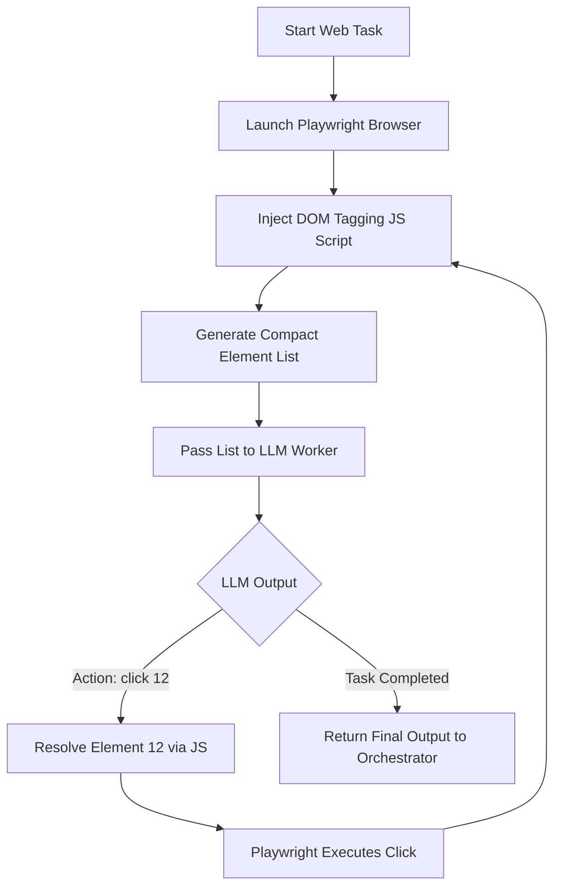

# Implementation Guide: Non-Visual Browser Control for AI Agents

Integrating browser automation into an AI agent without resorting to visual-only screenshot models is critical for performance, token economy, and execution reliability. By utilizing structural page representations, the agent can understand and interact with the web directly through semantic data.

Below is an architectural breakdown of the leading non-visual browser control technologies, including **Model Context Protocol (MCP)**, **Accessibility Trees**, **DOM Distillation**, **API Hijacking**, and open-source frameworks.

---

## 1. Model Context Protocol (MCP) Browser Servers

[Model Context Protocol (MCP)](https://modelcontextprotocol.io) is an open standard designed by Anthropic to expose system tools to LLMs. There are standard browser-specific MCP servers, such as the official `@modelcontextprotocol/server-puppeteer` (or community Playwright equivalents).

### How it Works

1. A Node.js-based MCP server runs in the background, spawning and managing a Chromium instance via Puppeteer.
2. It exposes a standard set of JSON-RPC tools over `stdio` or `SSE` (Server-Sent Events).
3. The Python-based agent acts as an **MCP client**, invoking tools and receiving clean text/HTML responses.

### Tools Exposed by Puppeteer MCP

* `puppeteer_navigate`: Go to a URL.
* `puppeteer_click`: Click an element using CSS selectors.
* `puppeteer_fill`: Populate an input field.
* `puppeteer_hover` / `puppeteer_select`: Interaction primitives.
* `puppeteer_evaluate`: Run arbitrary JavaScript in the page context.

> [!NOTE]
> Viewport screenshots are supported, but the protocol functions perfectly in a text-only mode by extracting page content or evaluating selectors.

### Python Integration Pattern

You can interact with the Puppeteer MCP server from your Python backend using the official `mcp` Python SDK:

```python
import asyncio
from mcp import ClientSession, StdioServerParameters
from mcp.client.stdio import stdio_client

# Parameters to run the Node.js MCP server
server_params = StdioServerParameters(
    command="npx",
    args=["-y", "@modelcontextprotocol/server-puppeteer"]
)

async def run_browser_task(url: str, prompt: str):
    async with stdio_client(server_params) as (read_stream, write_stream):
        async with ClientSession(read_stream, write_stream) as session:
            # Initialize connection
            await session.initialize()
          
            # Navigate using MCP tools
            await session.call_tool("puppeteer_navigate", arguments={"url": url})
          
            # Run selector query or page evaluation to get state
            result = await session.call_tool("puppeteer_evaluate", arguments={
                "javascript": "document.body.innerText"
            })
            print("Page Text:", result)
```

---

## 2. Accessibility (a11y) Tree Snapshotting

Every modern browser maintains an internal **Accessibility Tree** (derived from the DOM) to serve screen readers. This tree strips away formatting, scripts, dynamic styles, and layout elements, leaving only a structured hierarchy of semantic controls.

### How it Works

Using native Playwright or Puppeteer APIs, the agent extracts the accessibility tree snapshot. The tree contains nodes with:

* **Role**: `button`, `link`, `textbox`, `combobox`, `heading`, etc.
* **Name**: The semantic label of the element (e.g. `"Submit"`, `"Search Products"`).
* **State**: `focused`, `disabled`, `expanded`, `checked`.

### Token Savings Example

* **Raw HTML**: 100KB - 500KB (~25,000 to 125,000 tokens).
* **Accessibility Tree**: 2KB - 10KB (~500 to 2,500 tokens). A **95%+ reduction** in context window overhead.

### Python Playwright Implementation

```python
import asyncio
from playwright.async_api import async_playwright

async def get_accessible_tree(url: str):
    async with async_playwright() as p:
        browser = await p.chromium.launch(headless=True)
        page = await browser.new_page()
        await page.goto(url)
        await page.wait_for_load_state("networkidle")
      
        # Capture the accessibility snapshot
        a11y_snapshot = await page.accessibility.snapshot()
      
        await browser.close()
        return a11y_snapshot

# Example output structure:
# {
#   'role': 'RootWebArea', 'name': 'GitHub',
#   'children': [
#       {'role': 'link', 'name': 'Sign in'},
#       {'role': 'textbox', 'name': 'Search GitHub'},
#       {'role': 'button', 'name': 'Search'}
#   ]
# }
```

---

## 3. DOM Distillation & Interactive Element Tagging (The JavaScript Injection Method)

This is the core technique driving frameworks like `browser-use`. Instead of passing the whole DOM, you inject a lightweight JavaScript script to scan the page, isolate interactive nodes, assign them sequential indices, and present a clean list to the LLM.

### How it Works

1. Inject a script that checks if elements are visible, clickable, or input-capable.
2. Inject a custom attribute (e.g., `data-agent-id="12"`) to those elements.
3. Generate a condensed list of these elements for the LLM.
4. The LLM returns commands like `click(12)` or `fill(15, "value")`.



### Python Playwright Implementation

```python
import asyncio
from playwright.async_api import async_playwright

DOM_DISTILL_SCRIPT = """
() => {
    const interactiveElements = [];
    const elements = document.querySelectorAll('button, a, input, select, textarea, [role="button"], [onclick]');
    let idCounter = 0;
  
    elements.forEach(el => {
        // Filter out hidden or off-screen elements
        const rect = el.getBoundingClientRect();
        if (rect.width > 0 && rect.height > 0 && window.getComputedStyle(el).visibility !== 'hidden') {
            const id = idCounter++;
            el.setAttribute('data-agent-id', id);
            interactiveElements.push({
                id: id,
                tag: el.tagName.toLowerCase(),
                type: el.type || '',
                text: el.innerText.trim() || el.placeholder || el.getAttribute('aria-label') || '',
                role: el.getAttribute('role') || ''
            });
        }
    });
    return interactiveElements;
}
"""

async def run_tagged_browser_action(url: str):
    async with async_playwright() as p:
        browser = await p.chromium.launch(headless=True)
        page = await browser.new_page()
        await page.goto(url)
      
        # Inject script and get elements
        elements = await page.evaluate(DOM_DISTILL_SCRIPT)
      
        # Format elements for the LLM prompt
        formatted_list = []
        for el in elements:
            formatted_list.append(f"[{el['id']}] {el['tag'].upper()}: \"{el['text']}\" (Type: {el['type']}, Role: {el['role']})")
      
        print("\n".join(formatted_list))
        # Example output:
        # [0] A: "Sign in" (Type: , Role: )
        # [1] INPUT: "Search" (Type: text, Role: )
      
        # LLM decides: "Type 'python' into ID 1, then click ID 0"
        # We target the element using CSS selector [data-agent-id="1"]
        await page.fill('[data-agent-id="1"]', "python")
        await browser.close()
```

---

## 4. Headless API Session Hijacking (Hybrid/Emulated)

The fastest and most reliable non-visual browser control is actually to bypass browser rendering altogether once authentication is established.

### How it Works

1. Use Playwright/Puppeteer (headed or headless) to perform the initial login sequence, solve CAPTCHAs, or execute multi-factor authentication (MFA).
2. Export the active browser cookies, session storage, and request headers.
3. Hand these credentials to a standard Python HTTP client (like `httpx` or `requests`).
4. The agent interacts directly with the website's REST or GraphQL APIs to fetch/write data, completely bypassing browser UI interaction.

### Python Pattern

```python
import httpx
from playwright.async_api import async_playwright

async def hijack_session(url: str):
    async with async_playwright() as p:
        browser = await p.chromium.launch(headless=False) # Open headed for manual login if needed
        context = await browser.new_context()
        page = await context.new_page()
        await page.goto(url)
      
        # Wait for user to log in manually or run automated login script
        input("Press Enter once logged in...")
      
        # Extract cookies
        cookies = await context.cookies()
        await browser.close()
      
    # Convert cookies to httpx-compatible dictionary
    cookie_dict = {c['name']: c['value'] for c in cookies}
  
    # Execute lightning-fast HTTP calls directly to backend APIs
    async with httpx.AsyncClient() as client:
        response = await client.get("https://target-site.com/api/user/dashboard", cookies=cookie_dict)
        return response.json()
```

---

## 5. LaVague (Large Action Model Framework)

[LaVague](https://github.com/lavague-ai/LaVague) is an open-source Large Action Model (LAM) framework designed to compile natural language instructions directly into Selenium or Playwright actions.

### How it Works

* It uses **LlamaIndex** to chunk and vectorize the DOM (acting as a local RAG system for the HTML structure).
* When you give an instruction like *"Get the current stock price of Google"*, LaVague searches the DOM vectors for the relevant node elements, retrieves just those parts, and uses an LLM to generate the exact code or action to perform.
* Best if you want a complete out-of-the-box framework in Python that handles complex DOM searches autonomously.

---

## Technical Comparison Matrix

| Technology                   | Token Cost         | Dynamically Rendered Pages | Anti-Bot / CAPTCHA                         | Implementation Overhead    | Execution Speed   |
| :--------------------------- | :----------------- | :------------------------- | :----------------------------------------- | :------------------------- | :---------------- |
| **Browser MCP**        | Medium             | Good                       | Poor (Headless)                            | Medium                     | Moderate          |
| **Accessibility Tree** | **Very Low** | Excellent                  | Poor (Headless)                            | Low                        | Fast              |
| **DOM Tagging (JS)**   | Low                | Excellent                  | Poor (Headless)                            | Low                        | Fast              |
| **API Hijacking**      | **None**     | N/A                        | **Excellent** (Can solve via Headed) | High (Manual API analysis) | **Instant** |
| **LaVague (RAG DOM)**  | Medium             | Moderate                   | Poor (Headless)                            | High                       | Slow              |

---

## Integrating a Browser Worker into Your Orchestrator

Since your agent runs a LangGraph-style orchestrator (`orchestrator.py`) with specialized workers (`workers.py`), the cleanest way to implement this is to add a `BrowserWorker` node.

Here is an architectural blueprint of how you can integrate it:

### Step 1: Define Browser Tools

Create a set of browser tools in `available_tools.py` using **Playwright with DOM Tagging/Accessibility Tree**:

```python
# src/CoreFunctions/LangGraph/browser_tools.py
from langchain_core.tools import tool
from playwright.async_api import async_playwright

class PlaywrightBrowserContext:
    def __init__(self):
        self.playwright = None
        self.browser = None
        self.page = None

    async def start(self):
        self.playwright = await async_playwright().start()
        self.browser = await self.playwright.chromium.launch(headless=True)
        self.page = await self.browser.new_page()

    async def stop(self):
        if self.browser:
            await self.browser.close()
        if self.playwright:
            await self.playwright.stop()

browser_ctx = PlaywrightBrowserContext()

@tool
async def browser_navigate(url: str) -> str:
    """Navigate to a target URL and return the accessibility tree structure."""
    if not browser_ctx.page:
        await browser_ctx.start()
    await browser_ctx.page.goto(url)
    await browser_ctx.page.wait_for_load_state("networkidle")
  
    # Retrieve clean accessibility snapshot
    snapshot = await browser_ctx.page.accessibility.snapshot()
    return f"Successfully navigated. Page Structure:\n{snapshot}"

@tool
async def browser_click(selector: str) -> str:
    """Click an element using standard CSS selectors or text matches."""
    await browser_ctx.page.click(selector)
    await browser_ctx.page.wait_for_load_state("load")
    snapshot = await browser_ctx.page.accessibility.snapshot()
    return f"Clicked {selector}. New Page Structure:\n{snapshot}"
```

### Step 2: Add `BrowserWorker` in `workers.py`

Compile a new specialized agent worker and map it inside `AGENT_MAP`:

```python
# Add to src/CoreFunctions/StateGraph/workers.py

SYSTEM_PROMPT_BROWSER = """You are BrowserWorker. You navigate websites, search information, fill out forms, and automate web tasks.
You do not see screenshots; instead, you navigate using clean semantic accessibility trees and selectors.
Analyze the page structure returned after each tool call to decide which selectors or controls to target next.
""" + THINKING_INSTRUCTION

# Compile the agent
from src.CoreFunctions.LangGraph.browser_tools import browser_navigate, browser_click # example tools
browser_tools = [browser_navigate, browser_click]
BROWSER_AGENT = create_react_agent(llm, browser_tools, prompt=SYSTEM_PROMPT_BROWSER)

# Update AGENT_MAP
AGENT_MAP["BrowserWorker"] = BROWSER_AGENT

# Add Node handler
def browser_worker_node(state: AgentState):
    task = _get_active_task(state)
    if not task: return {}
  
    final_data = _run_ephemeral_agent("BrowserWorker", task["description"], state.get("working_memory", {}))
    return _update_state_completed(state, task["id"], final_data)
```
