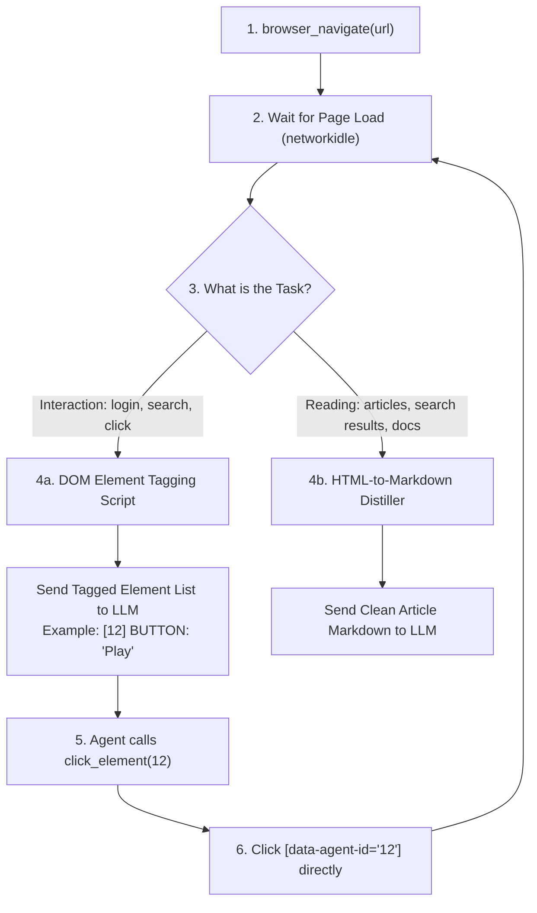

# 🌐 Web Browser Automation Reform: DOM Distillation & Markdown Conversion

This document evaluates the limitations of the current Accessibility (a11y) Tree browser control model and details the architectural plan to transition to a hybrid system using **DOM Element Tagging** for control and **Markdown Conversion** for content reading.

---

## 1. Limitations of the Current Accessibility Tree Model

Currently, the assistant uses Playwright’s native `page.accessibility.snapshot()`. While conceptually clean, it has several critical failure points in practice:

1. **Headless Limitations**: In headless mode, browsers often disable or restrict the accessibility engine unless specific hardware acceleration or OS-level screen reader hooks are simulated. This results in empty or severely degraded snapshots.
2. **Dynamic Hydration Delays**: Sites like YouTube Music and Gmail rely heavily on client-side JavaScript hydration. The snapshot is often captured before the dynamic content is loaded, returning a blank tree.
3. **No Selector Translation**: If the model fails to click using a role/name (which happens often due to ambiguous accessible labels) and wants to fallback to a CSS selector, the a11y tree provides **zero CSS information** (no classes, IDs, or element tags). The model is forced to blind-guess selectors (e.g., `#search`).
4. **Ambiguity**: Multiple elements can have the same role and name (e.g. five identical `[link] "Play"` buttons next to different songs), making index-based selection highly error-prone.

---

## 2. The Solution: A Hybrid Web Interaction System

Instead of relying on a single representation of the web page, we should split the browser's view based on the task type:

---

## 3. Deep-Dive: DOM Element Tagging (For Interaction)

This technique is used by advanced web agents (like `browser-use`). Instead of sending raw HTML or abstract roles, we inject a custom JavaScript script into the page that:
1. Traverses the active DOM tree.
2. Identifies elements that are visible, clickable, or input-capable.
3. Injects a temporary unique attribute (e.g., `data-agent-id="42"`) directly into the HTML element.
4. Returns a condensed text list of these interactive nodes to the LLM.

### 🌟 Advantages over a11y Trees
* **100% Click Accuracy**: The LLM does not need to guess CSS selectors or find unique names. If it wants to click the button labeled "Sign In" marked with `[42]`, it calls a tool `click_element(id=42)`. The backend runs `document.querySelector('[data-agent-id="42"]').click()`. This is infallible.
* **Solves Ambiguity**: Every interactive element gets a distinct integer ID, even if they share the same label or class.
* **Low Token Cost**: Strips out all layout divs, scripts, styles, and static text, reducing a 500KB page down to 5KB of interactive nodes.

---

## 4. Deep-Dive: Markdown Conversion (For Information Retrieval)

When the agent needs to read articles, documentations, or search result listings, interactive elements are secondary. The agent needs the **written content**.

### 🌟 Advantages of Markdown
* **Natural Reading Flow**: LLMs are pre-trained on massive amounts of Markdown formatted data. They parse headings (`#`), lists (`*`), tables, and bold text far better than raw HTML structures or fragmented a11y strings.
* **Readability Filtering**: We can run a readability distiller (like Mozilla's Readability algorithm) to strip away header navs, sidebars, cookie banners, and footers, leaving only the core markdown text of the article.
* **Semantic Hierarchy**: Preserves the actual relationships of text elements (e.g., which paragraph belongs under which heading).

---

## 🚀 The Reformed Browser Toolset

To implement this, we would replace the current browser tools with a simplified, robust set of 5 core functions:

1. **`browser_open(url)`**: Navigates to a page and returns the Markdown representation of the page (for reading) along with a summary count of interactive elements.
2. **`browser_get_elements()`**: Runs the DOM tagging script and returns the structured list of interactive elements (e.g., `[id] TAG: label (details)`).
3. **`browser_click_element(id)`**: Clicks the element matching `data-agent-id` and returns the updated page state.
4. **`browser_input_element(id, text)`**: Fills the input field matching `data-agent-id` and triggers the appropriate change events.
5. **`browser_extract_markdown()`**: Re-extracts and returns the full readable text of the current page as Markdown.
