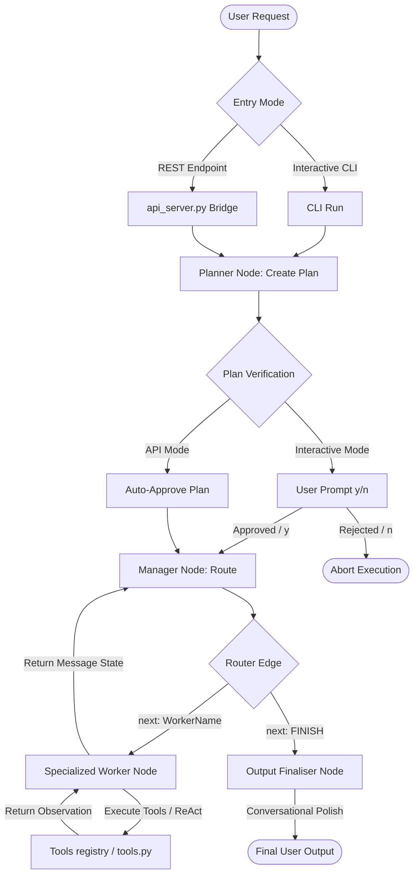

# 🤖 Multi-Agent Orchestration: Detailed Flow, Threat Analysis & Resolution Strategies

This document provides a highly technical, end-to-end breakdown of the **AI Personal Assistant Backend's** execution flow (built on LangGraph). It maps each step of execution, explains its underlying mechanics, identifies critical **architectural, model-level, and operational flaws**, and proposes **actionable, code-level resolution strategies** for each.

---

## 🗺️ Complete Agent Execution Flow

Below is the chronological path a user request takes through the system, from entry to final output.



---

## 🔍 Step-by-Step Breakdown, Flaw Analysis & Resolution Strategies

---

### Step 1: User Request & Entry Point
A command is submitted (e.g. *"Get system stats and save to report.txt"*).
* **CLI Mode**: Handled in `main_graph.py` by `process_request_interactive()`.
* **API Server Mode**: Handled in `api_server.py` calling `process_command()` in `src/CoreFunctions/agent_logic.py`.
* **Mechanics**: Initializes an `AgentState` consisting of `messages` (a list of BaseMessages), `next` (target node pointer), and `final_response` (string).

#### 🔴 Potential Flaws
1. **Unfiltered Context Growth**: In REST mode, if large historical chat payloads are passed continuously without slicing/pruning, the state will eventually overflow the local LLM's context window.
2. **REST-Planner Disconnect**: Because the REST API server does not support human-in-the-loop interaction, it must bypass/auto-approve the planning stage, removing the critical safety check against malicious or faulty plans.

#### 🟢 Resolution Strategies
* **Historical Payload Truncator**: Implement a rolling history trimmer in `agent_logic.py` before passing history payload to the graph.
  ```python
  # Limit to last 10 messages to protect the context window
  trimmed_history = user_history[-10:] if user_history else []
  ```
* **Interactive Plan Callback**: Rather than auto-approving plans in `agent_logic.py`, the REST API should save the generated plan in the state as "pending" and return a `401 Approval Required` JSON payload. The client application then prompts the user and hits a `/api/chat/approve` endpoint, allowing secure human-in-the-loop execution via REST!

---

### Step 2: The Planner Node (`Planner`)
Acts as the initial reasoning layer (`src/CoreFunctions/LangGraph/planner_declare.py`).
* **Mechanics**: The system prompt (`PLANNER_PROMPT`) formats all available workers (`GmailWorker`, `ProductivityWorker`, `MemoryWorker`, `SystemWorker`). The local LLM (`gemma4:e4b`) evaluates the request and generates a sequential, numbered plan.

#### 🔴 Potential Flaws
1. **Single-Shot Planning Brittle**: If the Planner hallucinates a step or proposes an invalid worker, there is no self-correction mechanism. The graph will try to execute this flawed plan.
2. **Context Collapse on Complex Prompts**: Small models (`4B` size) struggle to build accurate conditional plans.
3. **Strict Formatting KeyErrors**: Prompt strings containing single literal `{}` JSON symbols fail inside `.format()` structures.

#### 🟢 Resolution Strategies
* **Self-Reflective Validation Loop**: Add a lightweight checker that runs after the LLM generates the plan. It parses the text for worker names and tool availability. If it detects a mismatch, it prompts the LLM to correct itself before committing:
  ```python
  # Simple parser validation
  for step in plan_steps:
      if not any(worker in step for worker in MEMBERS):
          # Trigger fallback/re-generation prompt
  ```
* **Double Curly Escaping**: Ensure all static JSON examples in your system prompts double their curly braces (e.g. `{{ "next": "SystemWorker" }}`) so python's `.format()` treats them as literals.

---

### Step 3: Plan Verification Interrupt
A gatekeeping step designed for human oversight.
* **Mechanics**: The graph compiles with `interrupt_after=["Planner"]`. In CLI mode, it pauses for approval; in API mode, it auto-approves.

#### 🔴 Potential Flaws
1. **Auto-Approval Exposure**: Bypassing the verification step on API calls opens up the system to unsafe execution paths.
2. **Lack of Dynamic Re-planning**: If a plan is rejected (`n`), the program simply aborts. There is no feedback loop where the user can request adjustments.

#### 🟢 Resolution Strategies
* **Feedback Input Re-route**: Instead of aborting execution on plan rejection, prompt the user for feedback: `Why is this rejected?`. Wrap the feedback in a `HumanMessage(content="Adjust plan: " + feedback)` and feed it back to the Planner node to re-generate the steps.

---

### Step 4: The Manager / Supervisor Node (`Manager`)
The orchestrator of execution (`src/CoreFunctions/LangGraph/manager_declare.py`).
* **Mechanics**: The Manager uses a structured LLM (`with_structured_output`) bound to a Pydantic `RoutingDecision` model. It decides the name of the next worker to invoke, or outputs `"FINISH"`.

#### 🔴 Potential Flaws
1. **Local LLM Structured Output Failure**: Forcing structured output on small, local models often fails during JSON decoding, crashing the graph.
2. **Infinite Routing Loops**: If a worker fails to execute a task and returns an error, the Manager might repeatedly send the request back to the same worker, resulting in a resource hang.

#### 🟢 Resolution Strategies
* **JSON Repair Parser**: Wrap the `structured_llm.invoke` inside a try-except block. If Pydantic parsing fails, pass the raw text to `json_repair` (or a regular-expression regex extractor) to parse the JSON manually and reconstruct the Pydantic object:
  ```python
  import re
  import json
  # Fallback extractor
  match = re.search(r'\{.*\}', raw_output, re.DOTALL)
  if match:
      parsed_data = json.loads(match.group(0))
      return RoutingDecision(**parsed_data)
  ```
* **Loop Guard Guardrail**: Maintain a dictionary in your `AgentState` that tracks the number of times each worker is called:
  ```python
  class AgentState(TypedDict):
      messages: Annotated[Sequence[BaseMessage], operator.add]
      next: str
      final_response: str
      worker_call_counts: dict  # Tracks execution occurrences
  ```
  Inside the Manager node, if `worker_call_counts[next_worker] > 3`, forcefully override `next = "output_finaliser"` and set `final_response = "Execution stopped due to a repetitive worker loop: " + last_observation`.

---

### Step 5: Specialized Workers & Tool Execution
Individual specialists executing tasks (`src/CoreFunctions/LangGraph/worker_define.py`).
* **Mechanics**: Workers are ReAct agents initialized via LangGraph's prebuilt `create_react_agent`, mapping tools from `tools.py` into executable JSON nodes.

#### 🔴 Potential Flaws
1. **Command Injection / Host Compromise**: The `SystemWorker` has absolute access to raw terminal/python executing tools. An injection can bypass password constraints.
2. **Context Window Flooding**: Huge payloads returned from tools (like reading a huge file or 100 emails) crash or flood the LLM's context size.

#### 🟢 Resolution Strategies
* **Sandboxed Workspace Restrictions**: Modify tool functions inside `src/Apps/FileOperations/file_manager.py` to prevent Directory Traversal attacks. Resolve all paths relative to a strict, sandboxed subdirectory, and raise a ValueError if path traverses outside the project root:
  ```python
  # Sandboxing logic
  base_sandbox = os.path.abspath("./workspace")
  target_path = os.path.abspath(user_provided_path)
  if not target_path.startswith(base_sandbox):
      raise PermissionError("Path traverses outside sandboxed workspace.")
  ```
* **Payload Truncation Wrapper**: Wrap all reading tools in a summarizer/truncation utility:
  ```python
  def read_file_tool(path):
      content = read_file(path)
      if len(content) > 3000:
          return f"[TRUNCATED for Context Safety] First 1500 chars:\n{content[:1500]}\n...\nLast 1500 chars:\n{content[-1500:]}"
      return content
  ```

---

### Step 6: Output Finaliser Node (`output_finaliser`)
The communication polish layer (`src/CoreFunctions/LangGraph/output_finaliser.py`).
* **Mechanics**: Polishes the raw message into friendly language using a higher temperature (0.7).

#### 🔴 Potential Flaws
1. **Fact Hallucination**: Higher temperature values can lead the finalizer to rewrite critical numbers, code syntax, or directories into natural but incorrect statements.
2. **Double Latency**: Running an additional LLM call adds a significant latency overhead.

#### 🟢 Resolution Strategies
* **Deterministic Low-Temp Parsing**: Reduce finalizer temperature to `0.1`.
* **Fact Lock System Prompt**: Instruct the finalizer:
  > *"CRITICAL RULE: Never alter or omit numbers, code snippets, directories, paths, email addresses, or specific outcomes. Your only job is to change the greeting and transitions to be friendly."*
* **Dynamic Polish Check**: If the raw response is already detected to be human-friendly or less than 50 characters, skip the Finalizer node entirely and pass the result straight to `END`, saving ~3 seconds of execution time.
