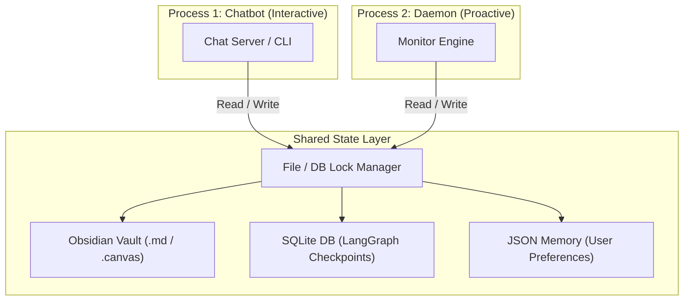
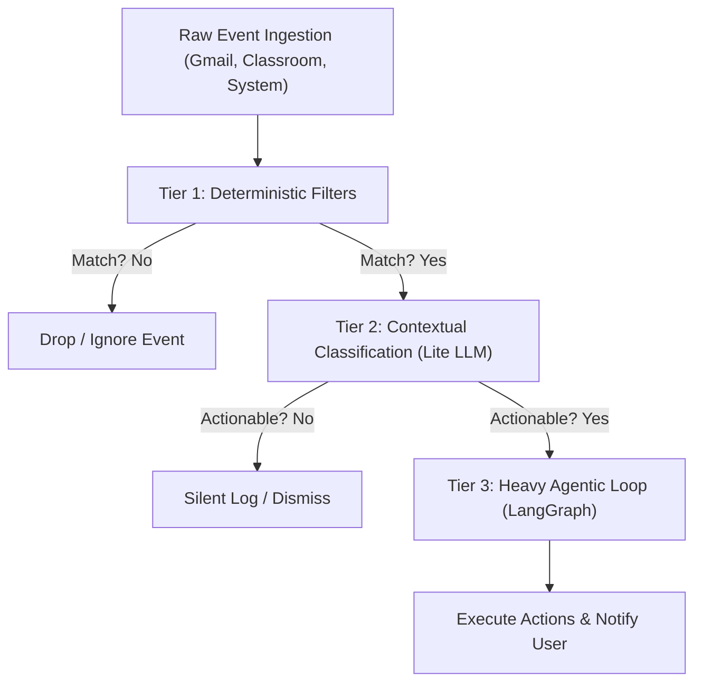

# 🧠 Deep-Dive Architecture: Decoupled Local Chatbot & Background Daemon

This document presents a conceptual analysis and design blueprint for separating your AI Personal Assistant into two local, decoupled components: the **Interactive Chatbot** and the **Proactive Background Monitor Daemon**. 

To maintain high architectural standards, this blueprint focuses entirely on system design, data flow, concurrency patterns, and integration mechanics (without code snippets).

---

## 1. The Core Philosophy: Reactive vs. Proactive Loops

To transform the assistant from a conversational chatbot to a true personal helper, the system must support two distinct execution profiles:

| Dimension | Reactive Chatbot (Process 1) | Proactive Background Monitor (Process 2) |
| :--- | :--- | :--- |
| **Execution Trigger** | User command (Text/Voice) | System event, API poll, or time-based cron |
| **User Presence** | Active (User is waiting for a response) | Passive/Absent (User is doing other work) |
| **Execution Style** | Immediate, low-latency conversational ReAct loop | Multi-stage background task scheduler |
| **Output Type** | Direct chat message UI | Desktop notification, Obsidian update, audio chime |
| **Resource Profile** | Burst CPU/Memory usage during chat turns | Ultra-low standby footprint, periodic API polls |

---

## 2. Process Concurrency & Shared State Management

Because both processes run simultaneously on your local Linux machine and interact with the same resources, we must design guardrails to prevent file-locking conflicts, database corruption, and state desynchronization.

### 💾 Shared Storage Architecture



### 🔒 Concurrency Control Strategies

1. **SQLite Write-Ahead Logging (WAL) Mode**:
   - By default, SQLite locks the entire database file during writes, which would cause crash errors if the Chatbot and Daemon write at the exact same millisecond.
   - **Strategy**: Configure the SQLite backend to run in WAL mode. This allows multiple concurrent readers and a single writer to operate without blocking each other.

2. **File-Level Locking (Obsidian & JSON Memory)**:
   - When the Daemon updates an Obsidian Markdown note or updates the long-term memory file (`user_info.json`), it must acquire a brief OS-level file lock.
   - **Strategy**: Implement an advisory file-locking mechanism. If the Chatbot tries to access the file while the Daemon holds the lock, it will wait (with a brief millisecond timeout) rather than throwing a read/write collision error.

3. **Obsidian Live Reload Compatibility**:
   - Obsidian natively watches the filesystem and updates its editor UI automatically when a note is edited by external scripts.
   - **Strategy**: The Daemon must write to Obsidian notes atomically (writing to a temporary file first, then swapping it) to ensure Obsidian never reads a partially written file.

---

## 3. The Three-Tier Event Filtering Pipeline

Invoking a multi-agent system with planning routers and reasoning models is heavy and time-consuming. If every unread email or minor system alert triggered a full LangGraph run, your system resources would spike, and Gemini API limits would quickly be exhausted. 

To prevent this, the Daemon uses a **Three-Tier Filtering Pipeline** to evaluate events before waking up the LLM:



### 🔍 Tier Detail
* **Tier 1: Deterministic Filters (Zero Cost)**:
  - Static, rule-based matching using rules defined in `config/alert_rules.json`.
  - *Example*: Ignoring emails from specific domains, filtering calendar events that don't match specific keywords, or verifying that CPU usage has been above 90% for at least 5 minutes.
* **Tier 2: Contextual Classification (Ultra-Low Cost)**:
  - If a rule matches, a very small, fast LLM (like `gemini-3.1-flash-lite` with 0 reasoning budget) evaluates the payload context.
  - *Example*: A new email is detected. The Lite LLM reads the subject and short snippet to answer a binary question: *"Does this email require an immediate response or schedule update? (Yes/No)"*
* **Tier 3: Heavy Agentic Loop (Full Orchestration)**:
  - If Tier 2 returns "Yes", the event is upgraded. The Daemon fires a request to the LangGraph Orchestrator (running with Gemini thinking configuration) to perform the multi-step task (e.g., refactoring the Obsidian Canvas, creating task lists, and drafting emails).

---

## 4. Local Inter-Process Communication (IPC)

Because the Chatbot and Daemon are separate processes, they need a clean way to communicate. If the Daemon detects a high-priority event, how does it command the Chatbot process to trigger LangGraph?

### 📡 IPC Options for Local Execution

1. **HTTP Loopback Service (Recommended)**:
   - The Chatbot's local Flask/FastAPI server (currently running on port 5000) acts as the central coordinator.
   - **Mechanism**: The Daemon runs as a pure client. When it needs the LLM agent to run, it makes a local HTTP POST request to `/api/chat` or `/api/agent/trigger` on localhost.
   - **Benefits**: Simple to implement, utilizes the existing Flask setup, and naturally serializes requests.

2. **Unix Domain Sockets (UDS)**:
   - A standard Linux IPC mechanism where processes exchange data via a special file socket on the filesystem.
   - **Mechanism**: The Chatbot server listens on a local socket file (e.g., `/tmp/assistant_ipc.sock`). The Daemon writes JSON control messages directly to this socket.
   - **Benefits**: Faster than HTTP loopback and doesn't consume network ports.

3. **SQLite Task Queue (Database Polling)**:
   - The processes communicate asynchronously through a database table.
   - **Mechanism**: The Daemon inserts a job record into a `background_tasks` table in the SQLite database. The Chatbot server runs a background thread that polls this table every few seconds, processes pending tasks, and writes the results back to the table.
   - **Benefits**: Decouples execution entirely; if the Chatbot server is closed, the Daemon can still queue tasks, which will run the moment the Chatbot is launched.

---

## 5. Human-in-the-Loop (HITL) Linux Integrations

A proactive assistant should not make modifications or send emails silently without your knowledge. On a Linux desktop environment, we can implement native interactive confirmation prompts:

### 🔔 Linux Interactive Notifications (DBus)
Using Linux's DBus-based desktop notification daemon, we can show notifications that include action buttons:

```text
+-------------------------------------------------------------+
|  ✉️  Draft Response Ready                                    |
|  I drafted a response to Professor Smith's assignment email. |
|                                                             |
|  [ View Draft in Obsidian ]    [ Send Email ]    [ Dismiss ]|
+-------------------------------------------------------------+
```

- When the Daemon completes a background workflow (like drafting an email), it sends a notification payload to DBus with custom action labels.
- The desktop environment renders these buttons natively.
- If you click "Send Email", the desktop notification daemon fires a callback back to our Background Monitor Daemon (via a listening DBus connection), which triggers `GmailWorker` to send the message.

---

## 🚀 Recommended Implementation Roadmap

1. **Phase 1: Separate the Engines**: Keep running the existing API server for the Chatbot, and create a brand-new background daemon script that runs a simple polling loop.
2. **Phase 2: Add Alert Filtering**: Integrate `config/alert_rules.json` into the daemon to evaluate incoming system events.
3. **Phase 3: Connect via Local Loopback**: Allow the daemon to make local HTTP requests to the Chatbot API to run background agent workflows.
4. **Phase 4: Add Desktop Interactions**: Integrate DBus notifications so you can approve background drafts directly from Linux desktop popups.
