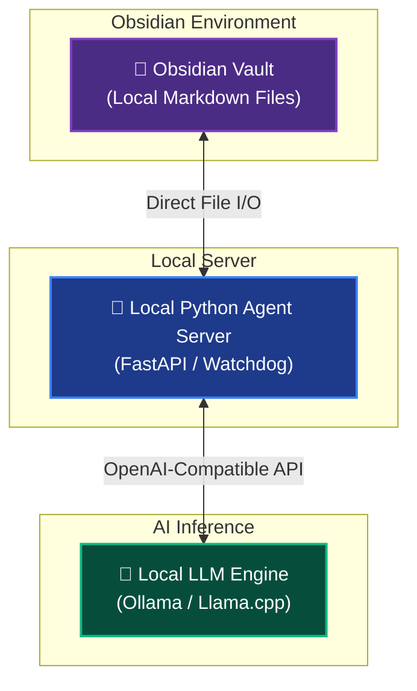

# 🛠️ Obsidian Agent System Architecture

To make the agent highly reliable, cognitive reasoning (planning) is decoupled from formatting and file management. While a larger brain (or the user) generates the raw ideas, the local agent (powered by **gemma4:e2b** or **gemma4:e4b**) acts as the dedicated "Obsidian Specialist"—responsible solely for translating plans into beautiful, fully connected vaults.

---

## 🏗️ Core Architecture Components

### 1. The Inference Engine (Backend)
Running local models like **gemma4:e2b** or **gemma4:e4b** requires a lightweight, optimized engine.

> [!TIP] Recommended Inference Setup
> * **Ollama** or **Llama.cpp** will serve as your local backend. They are incredibly resource-efficient and expose a local OpenAI-compatible API (`http://localhost:11434`).
> * **Model Choice:** The **gemma4:e2b** (highly efficient 2B parameter variant) and **gemma4:e4b** (larger 4B parameter variant, ~9.6 GB) models are exceptionally good at following instructions, structuring logical sequences, and formatting Markdown.

### 2. The Agent Core (The Brain & Executive)
To guarantee high-quality planning, the cognitive "thinking" process is completely separated from local file formatting. The planning is handled by you (the USER) or a larger, high-capacity model (cloud or large local model). The **obsidian_agent** (powered by **gemma4:e2b** / **gemma4:e4b**) is strictly responsible for formatting and writing:

> [!NOTE] Separation of Planning and Formatting
> * **Pass 1 (The Planner):** The high-level reasoning and detailed, step-by-step plan is generated either by a larger LLM or provided directly by the user.
> * **Pass 2 (The Formatter/Writer):** The local `gemma4:e2b` or `gemma4:e4b` model takes this pre-designed plan and transforms it into compliant, beautiful Obsidian Markdown, establishing metadata, links (`[[Link]]`), and tags, while the Python server writes it directly to the vault.

### 3. The File System Interface (The Hands)
Instead of relying on complex Obsidian plugins, your Python agent script can interact directly with your Obsidian Vault.

> [!IMPORTANT] Direct File I/O Advantages
> Because Obsidian stores everything as a local folder of standard `.md` files, your agent just needs standard file I/O permissions to create, read, and update files directly on your hard drive. This eliminates API overhead and keeps your data 100% local.

---

## 📋 Designing the Planning Template

To make the plans "highly detailed" as you requested, the agent needs a strict system prompt that forces it to follow a robust structural template. When the agent writes a file, it should automatically implement these Obsidian-specific features:

- [ ] **YAML Frontmatter:** For metadata tracking (e.g., date created, status, priority, tags).
- [ ] **Hierarchical Headings:** Clear `## Objectives`, `### Phase 1` breakdowns.
- [ ] **Obsidian Wikilinks:** Automatically creating `[[Project Dashboard]]` or `[[Daily Log - 2026-05-31]]` style hyperlinks so your notes stay interconnected.
- [ ] **Task Lists:** Using `- [ ]` checkboxes for actionable items.
- [ ] **Callouts:** Using syntax like `> [!NOTE]` or `> [!IMPORTANT]` to highlight crucial steps or risks in your plan.

---

## 🧠 Optimizing for gemma4:e2b / e4b Models

Since the local models are freed from the cognitive burden of "thinking" and planning, they can devote 100% of their attention window and parameters to perfect formatting. To guarantee formatting success:

> [!WARNING] Formatting Guardrails
> * **Strict System Prompting:** Define the role purely as a translator (e.g., *"You are a strict Obsidian Markdown Formatter. Translate the following plan into compliant Obsidian Markdown. Output ONLY Markdown. Do not add conversational text or chat."*).
> * **Single File Focus:** Have the agent format and write one file at a time rather than trying to construct multi-file structures in a single prompt.
> * **Temperature Tuning:** Keep the LLM temperature low (around `0.2` to `0.3`). This reduces "creativity" but drastically increases formatting reliability and adherence to your planning structure.

---

> [!QUESTION] Next Steps & Feedback
> How would you like to handle triggering this agent—would you prefer it to run as a background Python script monitored via the terminal, or are you looking to trigger it directly from a hotkey/command palette inside Obsidian itself?
