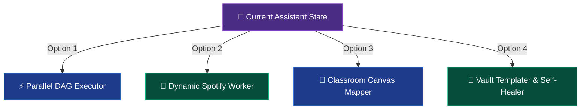
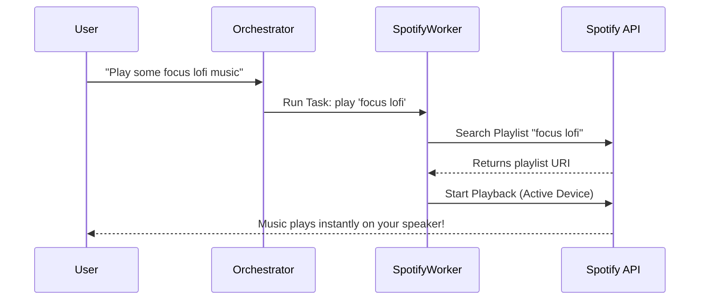

# 🚀 Next-Gen Assistant Feature Proposals & Technical Specifications

This proposal document details the architectural blueprints, code-level changes, and performance analyses for the next four major evolutionary leaps of the AI Personal Assistant backend.

---

## 🎨 Choose Your Next Evolutionary Step



---

## ⚡ Option 1: Parallel Worker Execution (DAG Branching)

### 📊 Latency Comparison
* **Sequential Loop (Current)**:
  `MemoryInjector (1s)` $\rightarrow$ `Router (2s)` $\rightarrow$ `GmailWorker (3s)` $\rightarrow$ `ClassroomWorker (3s)` $\rightarrow$ `Finalizer (1.5s)` = **Total: 10.5 seconds**
* **Parallel DAG Branching**:
  `MemoryInjector (1s)` $\rightarrow$ `Router (2s)` $\rightarrow$ `GmailWorker & ClassroomWorker (Concurrently: 3.2s)` $\rightarrow$ `Finalizer (1.5s)` = **Total: 7.7 seconds (27% faster)**

### 🛠️ Technical Implementation Spec

1. **Add Dependencies in Task Schema**:
   Update `SubTaskModel` inside [task_router.py](file:///home/prit/Project_Linux/AI-Personal-Assistant-Backend/src/CoreFunctions/StateGraph/task_router.py#L14-L23):
   ```python
   class SubTaskModel(BaseModel):
       id: str = Field(description="A unique identifier for the subtask, e.g., 'task_1'")
       description: str = Field(description="Clear instructions for the worker")
       assigned_worker: Literal[...] = Field(description="The worker assigned to this task")
       depends_on: List[str] = Field(
           default_factory=list, 
           description="List of subtask IDs that must complete before this task can execute."
       )
   ```

2. **Upgrade Orchestrator for Concurrent Invocations**:
   Refactor [orchestrator.py](file:///home/prit/Project_Linux/AI-Personal-Assistant-Backend/src/CoreFunctions/StateGraph/orchestrator.py) to identify **all** tasks that are `pending` and have **no pending dependencies**:
   ```python
   def orchestrator_node(state: AgentState):
       active_subtasks = state.get("active_subtasks", [])
       completed_task_ids = {t["id"] for t in active_subtasks if t["status"] == "completed"}
       
       # Gather all executable tasks
       executable_tasks = []
       for task in active_subtasks:
           if task["status"] == "pending":
               # Check if all dependencies are satisfied
               deps_satisfied = all(dep in completed_task_ids for dep in task.get("depends_on", []))
               if deps_satisfied:
                   executable_tasks.append(task)
       
       if executable_tasks:
           # Trigger parallel execution using Python concurrent features or LangGraph branches
           return {
               "next_node": "ParallelExecutionBridge",
               "tasks_to_run": executable_tasks
           }
   ```

---

## 🎵 Option 2: Dynamic Local Spotify Integration Worker

Enable natural language controls to command your music player directly from your terminal.



### ⚙️ Available Sandboxed Toolset
* `search_spotify(query: str, type: str = "playlist")`: Returns relevant Track or Playlist URIs.
* `control_spotify_playback(action: str, volume: int = None)`: Actions: `play`, `pause`, `next`, `previous`, `set_volume`.
* `get_current_playback_info()`: Returns currently playing track, artist name, and playback status.

### 📝 Worker Prompt Design (`workers.py`)
```python
SYSTEM_PROMPT_SPOTIFY = """You are SpotifyWorker. You are a dedicated local audio playback engineer.
Your job is to manage track searches, playlist playback, volume controls, and track queueing.
Always confirm the current active device before starting playback. If no device is active, request user to open Spotify.
""" + THINKING_INSTRUCTION
```

---

## 🏫 Option 3: Classroom Coursework Canvas Visualizer

Transform complex academic details into beautiful, visual, and interactive mind-map diagrams inside Obsidian.

```text
+-------------------------------------------------------------+
|                     ECE-302 COURSEWORK                      |
+-------------------------------------------------------------+
|                                                             |
|   [Assignment 1: Circuits] ----> [Deadline: 2026-06-15]     |
|              |                                              |
|              v                                              |
|   [Assignment 2: Signals]  ----> [Deadline: 2026-06-30]     |
|                                                             |
+-------------------------------------------------------------+
```

### 🛠️ Coordinate Mapping Layout Algorithm
Using the `create_or_update_obsidian_canvas` tool, the agent dynamically compiles a visual grid layout using strict coordinates ($X$, $Y$):

1. **Course Headings (Header Groups)**:
   * Placed at $Y=0$. Coordinates: $X=0, 400, 800$ for each course.
   * Group Width: $350\text{px}$, Height: $100\text{px}$.
2. **Assignments Cards (Note Nodes)**:
   * Cascaded downwards beneath each course heading:
     * Card 1: $Y=150$, Card 2: $Y=350$, Card 3: $Y=550$.
   * Node attributes: `type: "file"`, `file: "Academic/ECE302/Assignment_1.md"`.
3. **Connective Edges**:
   * Generates logical flow links from Course Node $\rightarrow$ Assignment Node $\rightarrow$ Deadline Node.

---

## 📂 Option 4: Templatized Note Vault & Auto-Link Integrity

Bring enterprise-grade quality control to your knowledge base. Prevent broken Wikilinks and maintain beautiful structural layouts.

### 📋 Standardized Markdown Templates
Every note created by `ObsidianNoteWorker` is automatically passed through a layout renderer to apply standardized CSS-friendly structures:

```markdown
---
category: ${category}
tags: [assistant-generated, ${custom_tags}]
created_at: ${current_time}
---

# 📓 ${note_title}

> [!NOTE]
> ${brief_summary_or_context}

## 🔍 Detailed Data
${formatted_markdown_body}

---
## 🔗 Backlinks & Connections
- Root Hub: [[Prithvi_Dashboard]]
```

### 🔗 Self-Healing Link Verification Routine (`ObsidianRefactorWorker`)
When activated, this worker runs an audit on your vault:
1. **Parse Links**: Uses regex `\[\[(.*?)\]\]` to identify all links pointing out of the newly generated files.
2. **Scan Directory Tree**: Checks if the target note exists in the vault.
3. **Self-Heal Fallbacks**:
   * If a target note doesn't exist, it automatically registers a task to compile that note OR replaces it with a search query fallback.
   * Modifies frontmatter metadata `broken_links: []` to keep tracking transparent.
