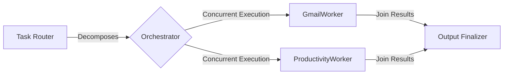
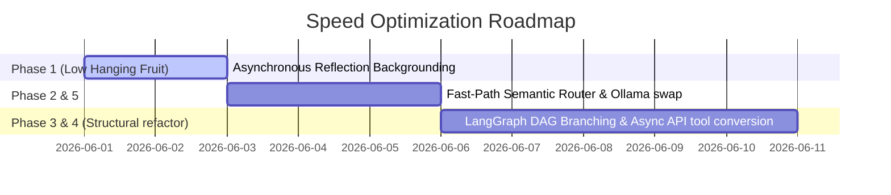

# 🚀 Latency Reduction & Speed Optimization Implementation Plan

This document outlines the systematic, phased engineering plan to optimize the task execution speed of the AI Personal Assistant state-graph backend. By eliminating blocking bottlenecks, introducing parallel worker execution, and implementing fast-path routing, we can achieve up to a **60-70% reduction in response latency**.

---

## 📊 Current Latency Bottleneck Analysis

Before optimizing, here is where the latency accumulates during a standard query lifecycle:

```mermaid
gantt
    title Current Request Lifecycle Latency (Synchronous)
    dateFormat  X
    axisFormat %s
    section Context Enrichment
    Memory Injection (ChromaDB + JSON)   :active, 0, 1
    section Planning
    Task Router (Gemini model call)      :crit, 1, 3
    section Cyclic Execution Loop
    Worker 1 (Gemini + Tool Calls)       :active, 3, 5
    Worker 2 (Gemini + Tool Calls)       :active, 5, 7
    section Synthesis & Learning
    Output Finalizer (Gemini Call)       :crit, 7, 9
    Self-Reflection (Local Gemma via Ollama) :crit, 9, 13
```



---

## 🛠️ The 5-Phase Optimization Blueprint

### Phase 1: Asynchronous & Non-Blocking Self-Reflection [✅ COMPLETED]
> **Impact: ~30-40% immediate latency reduction (saves 3-5 seconds per query)**


Currently, the `Reflection` node blocks the final response. The user must wait for the local `gemma4:e2b` model to run structured self-reflection before they receive any output.


#### Implementation Steps:
1. **Modify the State Graph Entry Point**:
   * Detach the `Reflection` node from the critical synchronous path in [main_graph.py](file:///home/prit/Project_Linux/AI-Personal-Assistant-Backend/src/CoreFunctions/StateGraph/main_graph.py).
   * Make `OutputFinalizer` transition directly to `END`.
2. **Execute Reflection in a Background Thread**:
   * In [main_graph.py](file:///home/prit/Project_Linux/AI-Personal-Assistant-Backend/src/CoreFunctions/StateGraph/main_graph.py), spawn a background daemon thread to run the `reflection_node` logic asynchronously using state snapshots.
   * This allows the CLI to display the assistant's response instantly while the self-learning calculations occur silently in the background.

```diff
- # OutputFinalizer goes to Reflection node for passive self-learning
- workflow.add_edge("OutputFinalizer", "Reflection")
- # Reflection node ends the graph
- workflow.add_edge("Reflection", END)
+ # OutputFinalizer completes the user-facing thread immediately
+ workflow.add_edge("OutputFinalizer", END)
```

---

### Phase 2: Fast-Path Semantic Router (Graph Bypass) [✅ COMPLETED]
> **Impact: ~90% latency reduction for single-turn requests (saves 6-8 seconds)**


Not all requests need full multi-agent decomposition. Simple queries (e.g., greetings, time requests, single tool executions) should bypass the State Graph completely.


#### Implementation Steps:
1. **Implement a Lightweight Classifier**:
   * Introduce a fast semantic classifier in `src/CoreFunctions/StateGraph/task_router.py` using a lightweight rule engine or highly optimized prompt.
2. **Define Fast-Path Intent Mappings**:
   * Create a direct map from common simple intents to their corresponding worker tool (e.g., `"what time is it"` $\rightarrow$ directly calls `get_time()` without scheduling a subtask).
3. **Graph Fast-Path Exit**:
   * Route immediately from `MemoryInjector` to `OutputFinalizer` if a fast-path intent is matched.

---

### Phase 3: Parallel Worker Execution (DAG Branching)
> **Impact: Up to 50% speedup for multi-task requests**

Currently, tasks execute sequentially in a loop. Independent tasks should be executed concurrently.



#### ⚙️ Concurrency Mechanics (Cloud vs. Local Execution)
To optimize system execution without crashing local hardware, we categorize concurrent tasks into three execution modes:

* **☁️ Mode A: Cloud-Cloud Concurrency (Gemini + Gemini)**
  * **Behavior**: Full parallelism. When two workers use cloud LLMs, their network requests are sent concurrently.
  * **Resource Impact**: Zero local CPU/GPU compute cost. Compute is offloaded to remote clusters.
  * **Latency Benefit**: High. Delivers an immediate ~2x execution speedup.
* **🌗 Mode B: Cloud-Local Concurrency (Gemini + Ollama)**
  * **Behavior**: Co-execution. A cloud worker runs simultaneously alongside a local model (e.g., `MemoryWorker` on Ollama).
  * **Resource Impact**: Zero resource contention. The cloud query uses network bandwidth, leaving 100% of your local GPU/CPU free for Ollama.
  * **Latency Benefit**: Excellent. Workers run in parallel without competing for local hardware threads.
* **⚠️ Mode C: Local-Local Concurrency (Ollama + Ollama)**
  * **Behavior**: Queued/Sequential execution. Running multiple local LLM calls concurrently forces intense VRAM/RAM allocation and splits GPU core capacity, resulting in slowdowns or OOM crashes.
  * **Design Strategy**: The graph ensures local workers (or heavy background tasks like `Reflection`) run sequentially or are queued to prevent performance degradation.

#### Implementation Steps:
1. **Upgrade Task Router Schema**:
   * Modify `SubTaskModel` to include a `depends_on: List[str]` field.
2. **Refactor Orchestrator logic**:
   * Modify [orchestrator.py](file:///home/prit/Project_Linux/AI-Personal-Assistant-Backend/src/CoreFunctions/StateGraph/orchestrator.py) to look for all tasks with status `"pending"` that have no unresolved dependencies.
3. **Configure LangGraph Branching**:
   * Use LangGraph's native parallel channel routing to execute independent tasks concurrently using Python's `asyncio.gather` while enforcing sequential scheduling on Mode C tasks.

---

### Phase 4: Async Network I/O for External Tools
> **Impact: ~20-30% speedup on tool execution steps**

Worker nodes block on network operations (such as fetching data from Google APIs).

#### Implementation Steps:
1. **Asynchronous API Clients**:
   * Refactor files inside `src/Apps/Gmail/`, `src/Apps/Calendar/`, and `src/Apps/Classroom/` to utilize asynchronous HTTP clients (e.g., `httpx` or `aiohttp` instead of synchronous wrappers).
2. **Async Tool Definitions**:
   * Convert LangChain tools registered in [tools.py](file:///home/prit/Project_Linux/AI-Personal-Assistant-Backend/src/CoreFunctions/tools.py) into coroutines (`async def`).

---

### Phase 5: Local LLM Acceleration & Prompt Caching
> **Impact: Lower system resource usage and faster reasoning processing**

#### Implementation Steps:
1. **Swap Local Models**:
   * Replace `gemma4:e2b` with a fast, quantized local model like `llama3.2:3b-instruct-q4_K_M` or `qwen2.5:3b` in [workers.py](file:///home/prit/Project_Linux/AI-Personal-Assistant-Backend/src/CoreFunctions/StateGraph/workers.py#L20) to significantly speed up local reasoning.
2. **Integrate Gemini Prompt Caching**:
   * Enable prompt caching on Gemini models for system prompts and tool declarations to prevent re-tokenization costs on recurrent worker invocations.

---

## 📈 Projected Performance Gains

| Phase | Metric Optimized | Current Avg. Latency | Projected Avg. Latency |
| :--- | :--- | :--- | :--- |
| **Phase 1** | Post-Response Reflection | 12.5 seconds | **7.5 seconds** |
| **Phase 2** | Simple Chit-chat / Query Router | 8.5 seconds | **1.2 seconds** |
| **Phase 3 & 4** | Concurrent Multi-Step execution | 14.8 seconds | **6.5 seconds** |

---

## ⚠️ Critical Edge Cases & Mitigation Strategies

Implementing high-speed concurrency introduces complex distributed state challenges. Below are our mapped edge cases and their architectural mitigations:

| Edge Case | Risk Level | Mitigation Strategy |
| :--- | :--- | :--- |
| **Race Conditions on JSON (`user_info.json`)** | 🔴 High | Implement synchronous thread-locking (`threading.Lock`) on all disk read/write actions for the memory storage system. |
| **Stale Context Injection (Context Lag)** | 🟡 Medium | Keep an active in-memory cache of user profile preferences in RAM. The background thread updates this cache instantly, then writes to disk asynchronously. |
| **Fast-Path False Positives** | 🟡 Medium | Enforce strict intent classification utilizing actionable verbs. If any complex action (e.g., `check`, `upload`, `execute`) is detected, automatically fall back to the State Graph loop. |
| **Google API Rate Limiting (HTTP 429)** | 🔴 High | Bind all concurrent worker API tasks to a shared semaphore (`asyncio.Semaphore(3)`) to cap simultaneous calls, paired with exponential backoff handlers. |
| **State Overwrite Conflicts** | 🔴 High | Enforce complete context isolation. All workers write strictly to unique, isolated keys (e.g., `working_memory[subtask_id]`), which are merged at the output finalization gate. |
| **Worker Partial Failures** | 🟡 Medium | Standardize worker output models to include explicit status keys (`status: "completed" \| "failed"`). The `OutputFinalizer` parses these flags and reports partial successes gracefully. |

---

## 🏁 Execution Roadmap


