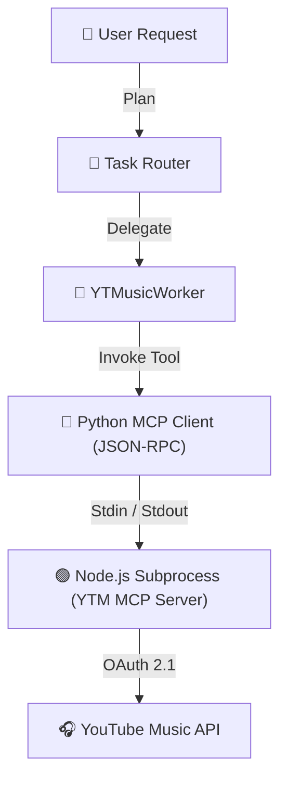

# 📋 Implementation Plan: YouTube Music MCP Server Integration

This document outlines the step-by-step technical plan to integrate the [youtube-music-mcp-server](https://github.com/CaullenOmdahl/youtube-music-mcp-server) into our AI Personal Assistant backend.

---

## 🏛️ System Architecture

The integration will use a hybrid model:
1. The **YouTube Music MCP Server** runs as an external Node.js subprocess.
2. A custom, zero-dependency async **MCP Client** written in Python will communicate with the Node.js server via `stdio` (stdin/stdout) using JSON-RPC 2.0.
3. The client will dynamically wrap the MCP server tools into LangChain `StructuredTool` instances, which will then be exposed to a new specialized worker: **YTMusicWorker**.



---

## 🛠️ Step-by-Step Execution Plan

### Step 1: Clone and Set Up the MCP Server Repository
We will clone the repository directly into our Google apps directory:
* **Target Path**: `src/Apps/Google/youtube-music-mcp-server`
* **Commands**:
  ```bash
  cd src/Apps/Google
  git clone https://github.com/CaullenOmdahl/youtube-music-mcp-server.git
  cd youtube-music-mcp-server
  npm install
  npm run build
  ```

---

### Step 2: Configure Environment Variables
The server requires Google OAuth Credentials configured in your `.env` file:
```ini
# YouTube Music MCP Credentials
GOOGLE_OAUTH_CLIENT_ID="your_google_oauth_client_id_here"
GOOGLE_OAUTH_CLIENT_SECRET="your_google_oauth_client_secret_here"
```

> [!IMPORTANT]
> To obtain these credentials:
> 1. Go to the [Google Cloud Console](https://console.cloud.google.com/).
> 2. Enable the **YouTube Data API v3** in your project.
> 3. Go to **Credentials**, create an **OAuth 2.0 Client ID** (Desktop Application type).
> 4. Add `http://localhost:8080` (or similar redirection URL if required by the server) to authorized redirects.

---

### Step 3: Implement the Async Python MCP Client (`src/CoreFunctions/mcp_client.py`)
To avoid adding heavy Python external packages, we will implement a lightweight, robust JSON-RPC client:

```python
import asyncio
import json
import os
import sys
from typing import Dict, Any, List

class MCPClient:
    def __init__(self, node_path: str, server_script: str, env: Dict[str, str]):
        self.node_path = node_path
        self.server_script = server_script
        self.env = env
        self.process = None
        self.request_id = 1
        
    async def start(self):
        """Starts the Node.js MCP server as a subprocess."""
        self.process = await asyncio.create_subprocess_exec(
            self.node_path, self.server_script,
            stdin=asyncio.subprocess.PIPE,
            stdout=asyncio.subprocess.PIPE,
            stderr=asyncio.subprocess.PIPE,
            env={**os.environ, **self.env}
        )
        # Perform Initialization Handshake
        await self._initialize()
        # Monitor Stderr in background for Auth URLs or Logs
        asyncio.create_task(self._read_stderr())

    async def _initialize(self):
        """Performs the JSON-RPC initialization handshake."""
        init_res = await self.call("initialize", {
            "protocolVersion": "2024-11-05",
            "capabilities": {},
            "clientInfo": {"name": "AI-Personal-Assistant-Client", "version": "1.0.0"}
        })
        # Send initialized notification
        await self.send_notification("notifications/initialized")
        return init_res

    async def call(self, method: str, params: Dict[str, Any]) -> Dict[str, Any]:
        """Sends a JSON-RPC request and reads response."""
        curr_id = self.request_id
        self.request_id += 1
        payload = {
            "jsonrpc": "2.0",
            "id": curr_id,
            "method": method,
            "params": params
        }
        self.process.stdin.write((json.dumps(payload) + "\n").encode())
        await self.process.stdin.drain()
        
        line = await self.process.stdout.readline()
        return json.loads(line.decode())

    async def send_notification(self, method: str, params: Dict[str, Any] = None):
        """Sends a JSON-RPC notification."""
        payload = {
            "jsonrpc": "2.0",
            "method": method,
        }
        if params:
            payload["params"] = params
        self.process.stdin.write((json.dumps(payload) + "\n").encode())
        await self.process.stdin.drain()

    async def _read_stderr(self):
        """Reads stderr stream to log Google OAuth URLs to the console."""
        while True:
            line = await self.process.stderr.readline()
            if not line:
                break
            log_line = line.decode().strip()
            if "https://" in log_line:
                print(f"\n🔑 [YTMusic Auth Required]: {log_line}\n")
            else:
                print(f"[YTMusic Server Log]: {log_line}")
```

---

### Step 4: Register Tools Dynamically (`available_tools.py`)
Wrap the MCP server's tools into LangChain `StructuredTool` instances:

```python
# In available_tools.py:
# We will define a global client and load its tools during startup
ytmusic_tools = [
    # Search & Discovery
    "mcp_ytmusic_search_songs",
    "mcp_ytmusic_search_albums",
    "mcp_ytmusic_search_artists",
    "mcp_ytmusic_get_song_info",
    "mcp_ytmusic_get_album_info",
    "mcp_ytmusic_get_artist_info",
    "mcp_ytmusic_get_library_songs",
    
    # Playlist Management
    "mcp_ytmusic_get_playlists",
    "mcp_ytmusic_get_playlist_details",
    "mcp_ytmusic_create_playlist",
    "mcp_ytmusic_edit_playlist",
    "mcp_ytmusic_delete_playlist",
    "mcp_ytmusic_add_songs_to_playlist",
    "mcp_ytmusic_remove_songs_from_playlist",
    
    # Smart Recommendation Playlists
    "mcp_ytmusic_start_smart_playlist",
    "mcp_ytmusic_add_seed_artist",
    "mcp_ytmusic_add_seed_track",
    "mcp_ytmusic_refine_recommendations",
    "mcp_ytmusic_get_recommendations",
    "mcp_ytmusic_preview_playlist",
    "mcp_ytmusic_create_smart_playlist",
    "mcp_ytmusic_get_user_taste_profile"
]
```

---

### Step 5: Add the YTMusicWorker to StateGraph
1. **Define Prompt**: Add a system prompt for `YTMusicWorker` in `workers.py`.
2. **Build Agent**: Initialize `YTMUSIC_AGENT` in `workers.py`.
3. **Register Agent Node**: Map `YTMusicWorker` to `YTMUSIC_AGENT` in `AGENT_MAP` and export the worker node.
4. **Update task_router.py**: Add `"YTMusicWorker"` to the list of possible assigned workers.

---

## 🔑 Authentication Handling & Testing Plan

1. **Initial Authentication Flow**:
   - When the backend starts the Node subprocess for the first time, the server will output a Google OAuth URL to standard error.
   - The user opens the URL, signs in, and authorizes the YouTube Music scopes.
   - Once authorized, the credentials will be cached locally inside a secure `tokens.json` file created by the MCP server inside the workspace.
   - Subsequent runs will boot instantly using cached credentials.
2. **Mock Test Flow**:
   - Run tests with environment `BYPASS_AUTH_FOR_TESTING=true` to verify JSON-RPC connectivity and mock responses without requesting OAuth during development.
