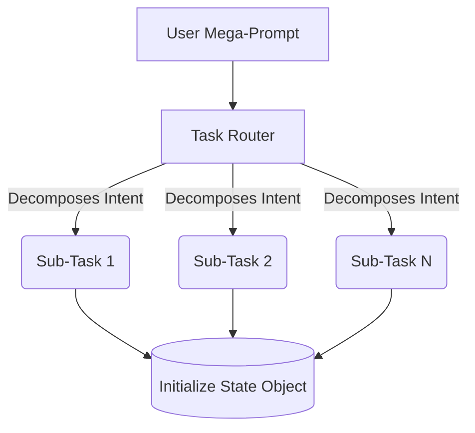
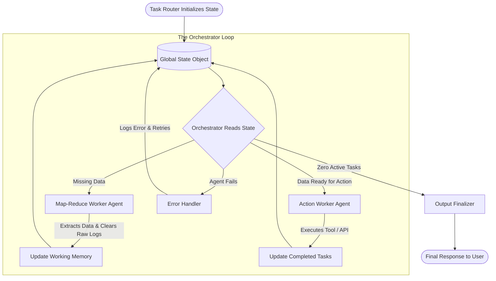

# Architecture Specification: Dynamic State-Graph Multi-Agent System

This document details the architecture for a highly resilient, dynamically routed multi-agent system. This approach relies on a **State-Graph Architecture**, designed to handle complex workflows asynchronously, eliminate context window overflow, and prevent AI hallucinations.

---

## 1. The Core: The Global State Object

The foundation of this system is the **State Object**. Instead of passing raw conversational history or long strings of text between agents, the entire system reads from and writes to a single, tightly controlled state. 

This ensures that agents only receive the exact, compressed context they need to perform their specific sub-task. Once a task is complete, temporary memory (like API error logs or raw data dumps) is wiped, keeping the LLM context window microscopic.

### State Object Schema Example
```json
{
  "session_context": {
    "primary_goal": "User's original complex prompt",
    "status": "in_progress",
    "active_subtasks": []
  },
  "working_memory": {
    "raw_data_extracted": {},
    "pending_actions": []
  },
  "completed_tasks": {},
  "error_logs": null
}
```

---

## 2. The Task Router

The Task Router is the entry point of the system. It acts as a semantic parser that evaluates the user's initial mega-prompt and decomposes it into isolated, independent sub-tasks.

### Key Responsibilities:
1. **Task Decomposition:** Slices a complex prompt into distinct, independent intent modules.
2. **State Initialization:** Populates the `active_subtasks` array in the State Object.
3. **Isolation:** Ensures that unrelated tasks do not share context, reducing token usage and confusion.

### Flowchart: Task Routing



---

## 3. The Orchestrator

The Orchestrator is the engine of the system. It acts as a **State Machine Evaluator**, operating in a continuous, cyclic loop until the `active_subtasks` list in the State Object is completely empty.

### Key Responsibilities:
1. **Read State:** Looks at the State Object to determine what data is currently available in `working_memory`.
2. **Dynamic Delegation:** Based *strictly* on the current State, it decides which specific Worker Agent to call next and provides it with precise input.
3. **Cyclic Evaluation:** Validates the execution of an agent *after* every action. If an agent fails, the Orchestrator pauses, allows targeted retries, or marks the task as failed without crashing the whole pipeline.

---

## 4. The Execution Loop

This is how a complex workflow moves through the system from start to finish.

### Flowchart: The State-Graph Execution Loop



### Step-by-Step Breakdown:

1. **Routing:** The user provides a prompt. The Task Router breaks it into logical goals and sets up the State Object.
2. **Evaluate:** The Orchestrator reads the State Object. It identifies an active sub-task but sees that the `working_memory` lacks the necessary data to execute it.
3. **Delegate (Data Gathering):** The Orchestrator calls a Worker Agent (often using a Map-Reduce pattern) to fetch and filter the required data.
4. **Update & Compress:** The Worker Agent finishes, updates the `working_memory` with clean JSON data, and the Orchestrator forcefully deletes the agent's scratchpad and raw data from the active memory pool.
5. **Re-Evaluate (Cyclic Check):** The Orchestrator reads the updated State Object. It now sees actionable data.
6. **Delegate (Action):** It dynamically routes the exact data to the relevant Action Agent (e.g., a Calendar or Email tool).
7. **Complete:** The Action Agent executes, updates `completed_tasks`, and clears `working_memory`.
8. **Finalization:** Once all `active_subtasks` are resolved, the Orchestrator passes the clean `completed_tasks` log to an Output Finalizer to generate a coherent, natural language response for the user.
