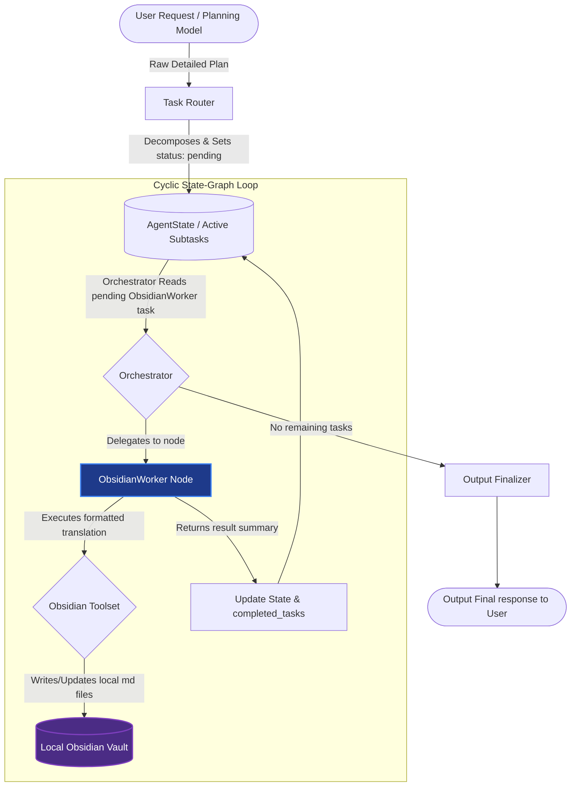
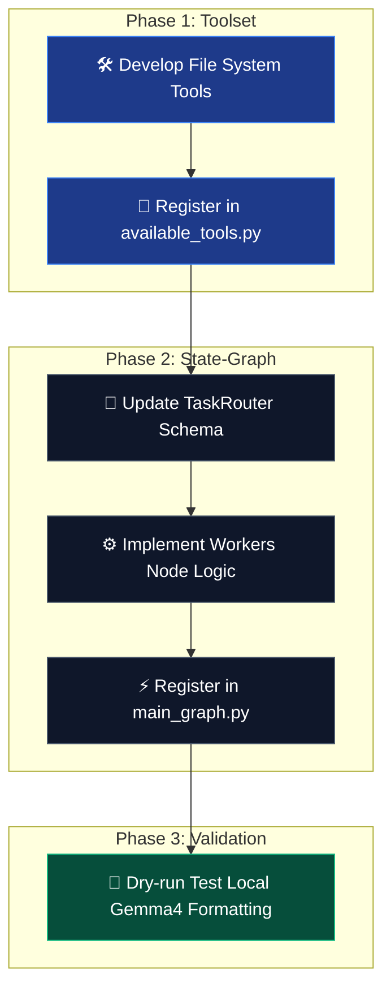

# 📋 Implementation Plan: Obsidian Agent State-Graph Integration

This document specifies the step-by-step engineering plan to integrate the **ObsidianWorker** into your existing dynamic State-Graph assistant backend. It follows the exact same cyclic routing patterns and structural principles established by other workers like `GmailWorker` and `SystemWorker`.

---

## 🛠️ 1. Architecture Overview

The `ObsidianWorker` is a specialized execution agent designed to translate high-level reasoning outputs (generated by user inputs or cloud models like Gemini) into clean, standard-compliant Obsidian markdown, and perform native file system updates directly inside your Obsidian vault.



---

## 📅 2. Implementation Steps



### 📍 Step 2.1: Define the Obsidian File Toolset
Create direct local file system tools to interface with your Obsidian vault. Since Obsidian operates on normal local `.md` files, we can implement standard, ultra-fast Python operations.

Add the following tool definitions to a new or existing module (e.g., `src/CoreFunctions/tools.py`):
```python
import os
import re

OBSIDIAN_VAULT_PATH = os.environ.get("OBSIDIAN_VAULT_PATH", "/home/prit/Obsidian/PersonalVault")

def create_obsidian_note(filename: str, content: str, folder: str = "") -> str:
    """Creates a new note inside the Obsidian vault with raw content."""
    target_dir = os.path.join(OBSIDIAN_VAULT_PATH, folder)
    os.makedirs(target_dir, exist_ok=True)
    
    # Ensure file has .md extension
    if not filename.endswith(".md"):
        filename += ".md"
        
    file_path = os.path.join(target_dir, filename)
    with open(file_path, "w", encoding="utf-8") as f:
        f.write(content)
    return f"Successfully created note '{filename}' at path: {file_path}"

def append_to_obsidian_note(filename: str, content: str, folder: str = "") -> str:
    """Appends logs, summaries, or tasks to an existing Obsidian note."""
    if not filename.endswith(".md"):
        filename += ".md"
    file_path = os.path.join(OBSIDIAN_VAULT_PATH, folder, filename)
    
    if not os.path.exists(file_path):
        return create_obsidian_note(filename, content, folder)
        
    with open(file_path, "a", encoding="utf-8") as f:
        f.write("\n" + content)
    return f"Successfully appended content to note '{filename}'"

def search_obsidian_vault(query: str) -> str:
    """Performs a global search across all notes in the vault for a keyword or tag."""
    matches = []
    # Search all .md files recursively
    for root, _, files in os.walk(OBSIDIAN_VAULT_PATH):
        for file in files:
            if file.endswith(".md"):
                full_path = os.path.join(root, file)
                try:
                    with open(full_path, "r", encoding="utf-8") as f:
                        content = f.read()
                        if query.lower() in content.lower():
                            rel_path = os.path.relpath(full_path, OBSIDIAN_VAULT_PATH)
                            matches.append(f"- [[{rel_path[:-3]}]]")
                except Exception:
                    continue
    if not matches:
        return f"No notes found matching query: '{query}'"
    return "Matching notes found:\n" + "\n".join(matches[:15])
```

---

### 📍 Step 2.2: Register Tools in `available_tools.py`
Add the new functions to `src/CoreFunctions/LangGraph/available_tools.py` to bundle them into a clean group for the agent:

```python
# In available_tools.py:
from src.CoreFunctions.tools import (
    create_obsidian_note,
    append_to_obsidian_note,
    search_obsidian_vault
)

# Create the obsidian toolset
obsidian_tools = [
    StructuredTool.from_function(create_obsidian_note),
    StructuredTool.from_function(append_to_obsidian_note),
    StructuredTool.from_function(search_obsidian_vault),
]

# Register in TOOL_MAP
TOOL_MAP.update({
    "create_obsidian_note": obsidian_tools[0],
    "append_to_obsidian_note": obsidian_tools[1],
    "search_obsidian_vault": obsidian_tools[2],
})
```

---

### 📍 Step 2.3: Extend `TaskRouter` to Support `ObsidianWorker`
Update `src/CoreFunctions/StateGraph/task_router.py` to allow the planner model to delegate file formatting and vault updates to our local worker:

1. Update the `assigned_worker` field's `Literal` typing schema:
   ```python
   assigned_worker: Literal[
       "SystemWorker", "GmailWorker", "ProductivityWorker", 
       "MemoryWorker", "ClassroomWorker", "ObsidianWorker" # <-- Added ObsidianWorker
   ]
   ```
2. Add the worker description to the `ROUTER_PROMPT`:
   ```text
   - ObsidianWorker: Takes pre-compiled plans or text data and writes/formats them into structured Obsidian notes with YAML frontmatter, wikilinks, callouts, and checklists.
   ```

---

### 📍 Step 2.4: Implement the `ObsidianWorker` Node in `workers.py`
Open `src/CoreFunctions/StateGraph/workers.py` and register the local compiler using Ollama's `gemma4` configurations:

```python
# 1. Import obsidian_tools from available_tools
from src.CoreFunctions.LangGraph.available_tools import obsidian_tools

# 2. Define the strict system prompt that enforces strict Obsidian output
SYSTEM_PROMPT_OBSIDIAN = """You are ObsidianWorker. You are a highly specialized local system note editor.
Your job is to take the pre-composed plans, lists, or structured text given in your task and format/save them into the Obsidian vault.
Always enrich the notes with:
- YAML frontmatter (metadata tracking tags, created date, category)
- Standard hierarchical headings (## objectives, ### phase breakdowns)
- Wikilinks ([[Page Name]]) to connect items
- Checkboxes (- [ ]) for tasks
- Visual callout boxes (> [!TIP], > [!IMPORTANT]) to represent notes and warnings.

IMPORTANT: You do NOT plan or think about what the tasks are. You translate the input plan into beautiful markdown files using your file tools.
"""

# 3. Compile the ReAct agent using the local LLM (gemma4)
OBSIDIAN_AGENT = create_react_agent(local_llm, obsidian_tools, prompt=SYSTEM_PROMPT_OBSIDIAN)

# 4. Map the agent globally
AGENT_MAP["ObsidianWorker"] = OBSIDIAN_AGENT

# 5. Define the worker state-graph node
def obsidian_worker_node(state: AgentState):
    task = _get_active_task(state)
    if not task: return {}
    
    final_data = _run_ephemeral_agent("ObsidianWorker", task["description"], state.get("working_memory", {}))
    return _update_state_completed(state, task["id"], final_data)
```

---

### 📍 Step 2.5: Register the Node in `main_graph.py`
Expose the node inside `src/CoreFunctions/StateGraph/main_graph.py` to compile it into the system state workflow:

```python
# 1. Import the node
from src.CoreFunctions.StateGraph.workers import obsidian_worker_node

# 2. Register the node in create_graph()
workflow.add_node("ObsidianWorker", obsidian_worker_node)

# 3. Add to the Orchestrator conditional router mappings
workflow.add_conditional_edges(
    "Orchestrator",
    orchestrator_router,
    {
        "SystemWorker": "SystemWorker",
        "GmailWorker": "GmailWorker",
        "ProductivityWorker": "ProductivityWorker",
        "MemoryWorker": "MemoryWorker",
        "ClassroomWorker": "ClassroomWorker",
        "ObsidianWorker": "ObsidianWorker",  # <-- Added
        "OutputFinalizer": "OutputFinalizer"
    }
)

# 4. Route back to Orchestrator after execution
workflow.add_edge("ObsidianWorker", "Orchestrator")
```

---

## 🎯 3. Verification & Execution Example

When you input a complex mega-prompt like:
> *"Read my upcoming classroom assignments and create a detailed study roadmap in my Obsidian vault under logs/study_plan.md"*

The graph pipeline will run smoothly like this:
1. **TaskRouter (Gemini)**: Decomposes into:
   - Subtask 1: `fetch_classroom_assignments` ➡️ `ClassroomWorker`
   - Subtask 2: `Format study plan under logs/study_plan.md based on assignments` ➡️ `ObsidianWorker`
2. **ClassroomWorker (Gemini-Lite)**: Fetches tasks and saves raw data into `working_memory`.
3. **ObsidianWorker (gemma4:e2b/e4b)**: Takes the raw assignments from `working_memory`, translates it into a beautiful, styled, connected Markdown plan with checklists and metadata, and calls `create_obsidian_note` to commit it to the vault.
4. **OutputFinalizer**: Notifies you that your study note has been successfully prepared!
